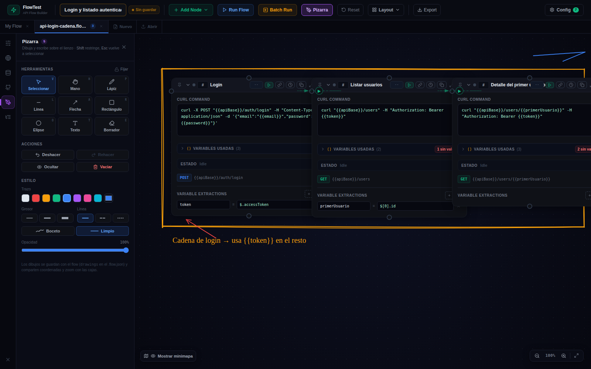
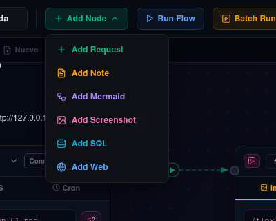
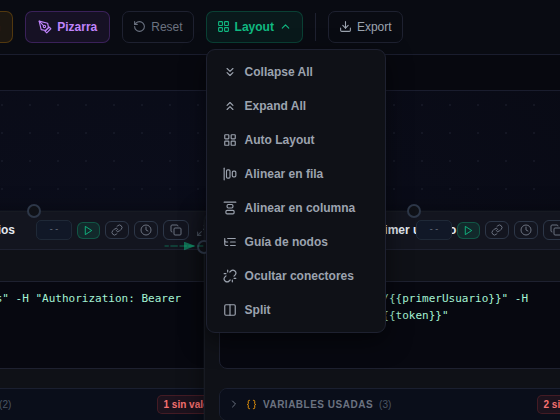
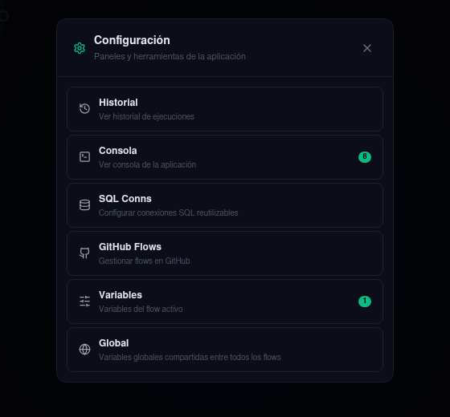
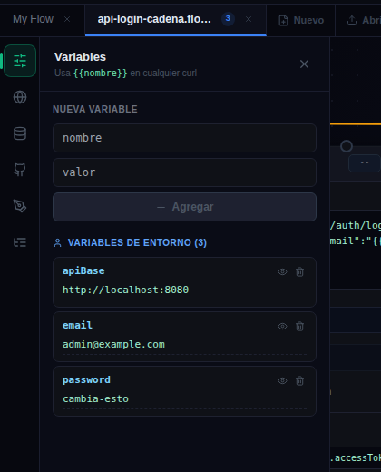
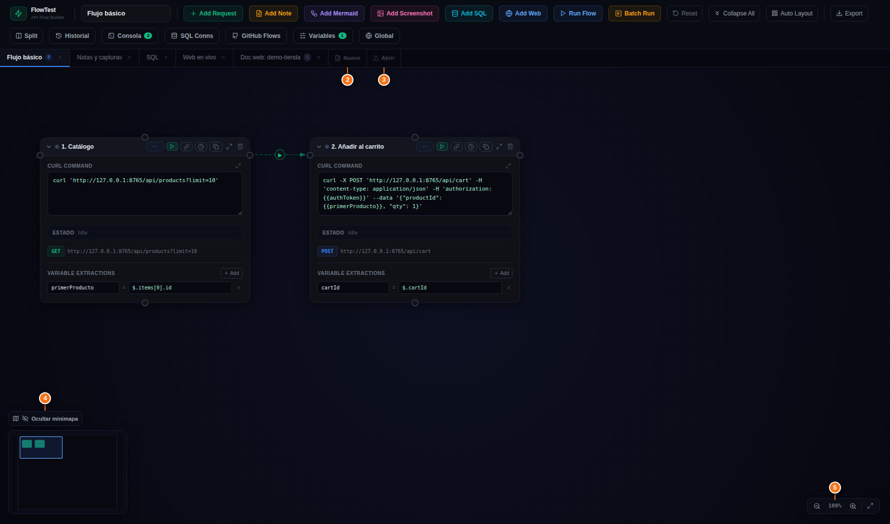
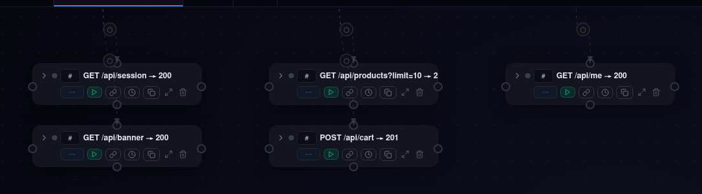
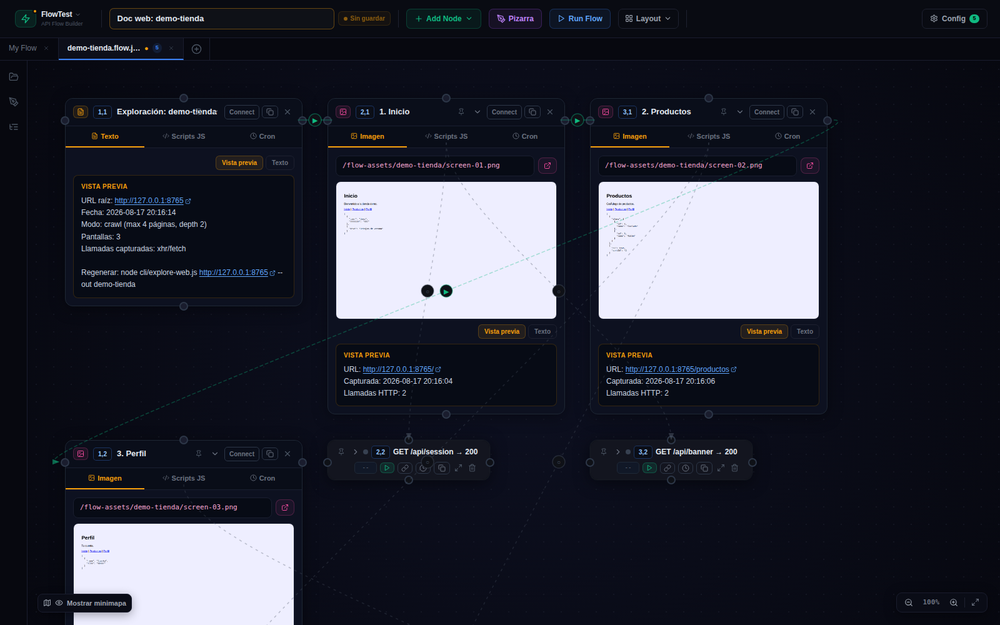
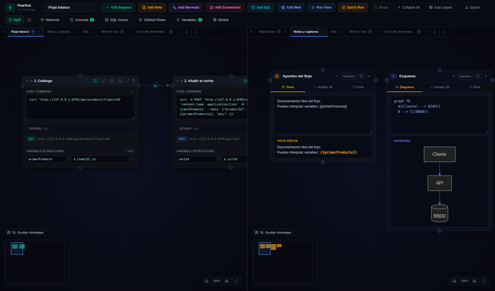

# 🖥 01 · La pantalla principal

> [!TIP]
> **Toolbar compacta (desde la 4.17) y barra lateral de iconos (4.24).** Los botones viven en desplegables (**Add Node**, **Layout**) y en el modal **Config**; los paneles laterales se eligen desde la barra de iconos de la izquierda, **uno visible a la vez**.

## La toolbar, botón a botón

| Botón | Qué hace |
|-------|----------|
| **⚡ FlowTest ▾** (logo) 🆕 | Menú del flow: **Nuevo flow**, **Abrir .flow.json…** (del disco local), **Guardar** (Ctrl+S), **Guardar como…** (Ctrl+Shift+S), **Export (descargar)** y **Reset**. Un punto ámbar sobre el logo avisa de cambios sin guardar |
| *(campo de texto)* | **Nombre del flow** activo (campo ancho desde la 4.25.9). Si hay cambios sin guardar aparece el aviso ámbar «Sin guardar» |
| **+ Add Node ▾** (verde) | Desplegable con los seis tipos de nodo (tabla siguiente) |
| **Pizarra** (morado) 🆕 | Abre el panel de la **pizarra**: dibujar y escribir sobre el lienzo, estilo Excalidraw ([08 Paneles y utilidades](08-paneles.md#pizarra)) |
| **Run Flow** | Ejecuta todo el flujo en orden topológico (las flechas mandan). Desde la 4.23 ejecuta antes los **scripts JS de las notas** y mete sus valores como variables |
| **Layout ▾** | Organización del canvas: colapsar, expandir, auto layout, alinear, **guía de nodos**, **ocultar conectores**, split |
| **Config** | Modal con **Batch Run**, Historial, Consola, SQL Conns, GitHub Flows, Variables y Global. El badge verde es el contador de la consola |

### El desplegable Add Node

| Opción | Qué añade |
|--------|-----------|
| **Add Request** (verde) | Cajita de petición HTTP (curl). La pieza básica |
| **Add Note** (ámbar) | Nota de texto libre con scripts JS opcionales |
| **Add Mermaid** (violeta) | Nota que renderiza un diagrama Mermaid en vivo |
| **Add Screenshot** (rosa) | Nodo Captura: muestra una imagen, o hace un screenshot de una web pegando su URL |
| **Add SQL** (cian) | Consulta a Postgres / MySQL / Oracle |
| **Add Web** (azul) | Vista de una web: iframe clásico o **modo Live** navegable |

### El desplegable Layout

| Opción | Qué hace |
|--------|----------|
| **Collapse All** | Colapsa todas las cajitas **y las acerca** conservando tu disposición |
| **Expand All** | Expande todo y **restaura las posiciones** previas al Collapse All |
| **Auto Layout** | Reordena los nodos por el grafo: cadena en columnas y cajitas informativas colgando de su padre |
| **Alinear en fila / en columna** | Coloca los nodos en fila o columna según su **nº de orden** (el campo `#` de cada cabecera) |
| **Alinear en cuadrícula** 🆕 4.28 | Coloca cada caja en la celda **`columna,fila`** escrita en su campo `#` (`1,1` arriba a la izquierda, `3,4` = columna 3, fila 4). Ver [más abajo](#alinear-en-cuadrícula-campo---columnafila--428) |
| **Guía de nodos** 🆕 | Panel lateral con todos los nodos por tipo y nombre; clic en uno → el lienzo se centra en él y lo resalta |
| **Ocultar / Mostrar conectores** 🆕 | Quita las líneas de conexión del lienzo (las conexiones siguen existiendo; útil para dibujar tus propias flechas en la pizarra) |
| **Minimapa** / **Controles de zoom** 🆕 4.25.8 | Conmutadores: ocultan o muestran el botón del minimapa y la botonera ± del lienzo. Ocultar la botonera **no cambia el zoom** (Ctrl + rueda sigue funcionando). Se recuerdan entre sesiones |
| **Split** | Pantalla dividida: dos flows a la vez. Con el split activo aparece la opción para cambiar la dirección |

### El modal Config

**Batch Run** (4.25.7), **Historial**, **Consola**, **Vista** 🆕 4.27 (tamaño de los nodos, modo compacto y separación entre cajas), **SQL Conns**, **GitHub Flows**, **Variables** (del flow activo) y **Global** (compartidas entre flows), cada uno con su badge contador. Detalle en [08 Paneles y utilidades](08-paneles.md).

## La barra lateral de iconos 🆕

A la izquierda del lienzo hay siempre una barra con tres iconos: **Proyecto** (los flows de `flows/`, 4.25), **Pizarra** y **Guía de nodos**. Los paneles de **Config** (Variables, Globales, Conexiones SQL, GitHub) aparecen en la barra solo mientras están abiertos y desaparecen al cerrarlos. Solo se ve **un panel a la vez**: clic en un icono lo abre (y cierra el anterior), clic en el icono activo lo cierra, y la ✕ de abajo cierra el panel abierto. El panel elegido se recuerda entre recargas.

## Pestañas, canvas y minimapa

- **Pestañas**: cada pestaña es un flow independiente. El botón **⊕** de la barra crea una vacía; para importar un `.flow.json` del disco local usa **⚡ FlowTest ▸ Abrir .flow.json…** (o abre los del proyecto desde el panel Proyecto). La ✕ cierra (avisa si hay cambios). Todo se **autoguarda en el navegador** (localStorage); además, desde la 4.25 cada pestaña abierta desde el proyecto **sabe cuál es su fichero** de `flows/` (la etiqueta muestra el nombre del fichero y un ● ámbar si hay cambios) y **Ctrl+S** lo guarda ahí. Export es para descargarlo fuera del proyecto.
- **Minimapa**: vista de pájaro del canvas (cajas **y dibujos de la pizarra**); clica para saltar a una zona. Arranca oculto — botón «Mostrar minimapa» abajo a la izquierda.
- **Zoom**: botones ± o **Ctrl + rueda**. Los dibujos de la pizarra escalan con las cajas.
- **Moverse**: botón central del ratón, o la herramienta **Mano** de la pizarra. Arrastra una cajita por su cabecera para recolocarla.
- **Escape** cancela una conexión a medias (y en la pizarra vuelve a Seleccionar).

## Cajitas colapsadas, nº de orden y 📌

- Una cajita colapsada es una **caja compacta**: se estrecha al ancho de su contenido (190–260 px según el tipo) y la fila de botones pasa **debajo del título**.
- Cada nodo tiene un campo **`#`** en la cabecera: su **nº de orden**, que usan *Alinear en fila/columna* y la *Guía de nodos*; se guarda en el `.flow.json` (`order`). Desde la 4.28 admite también una celda `columna,fila` (`cell`), ver abajo.
- El botón **📌 Fijar** (4.23) bloquea la posición de la caja: ni colapsar/expandir, ni Collapse/Expand All, ni alinear, ni el auto-layout, ni el arrastre la mueven. Se guarda como `pinned`.

### Alinear en cuadrícula (campo `#` = `columna,fila`) 🆕 4.28

En el campo **`#`** de cada cabecera puedes escribir, en vez de un número, una **celda `columna,fila`**: `1,1` es arriba a la izquierda, `3,4` la columna 3, fila 4 (se pinta en azul). **Layout ▸ Alinear en cuadrícula** coloca cada caja en su celda: cada columna se hace tan ancha como su caja más ancha y cada fila tan alta como la más alta (40 px de hueco; una columna o fila sin cajas deja 80 px). Las cajas sin celda y las 📌 fijadas no se mueven. **Auto Layout** también las respeta (4.28.1): coloca primero la cuadrícula y ordena por el grafo solo las cajas sin celda, debajo. La celda se guarda en el `.flow.json` (`cell: {col, row}`), se ve en la guía de nodos y en la caja compacta, y las acciones *Alinear en fila/columna* la respetan (orden de lectura detrás de los `#` numéricos). Por MCP: `cell` en `node_add_*` / `node_update` y `canvas_layout` con `mode: "grid"`.

## Pantalla dividida

Con **Layout ▸ Split** ves dos flows lado a lado (o arriba/abajo cambiando la dirección). Útil para comparar, o para copiar cajitas de un flow a otro con el botón **Copiar** de cada nodo. En split no se muestran los paneles laterales.
