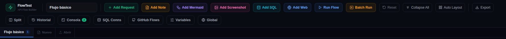

# 🖥 01 · La pantalla principal

## La toolbar, botón a botón

**Fila superior — crear y ejecutar:**

| Botón | Qué hace |
|-------|----------|
| *(campo de texto)* | **Nombre del flow** activo. Si hay cambios sin exportar aparece el aviso ámbar «Sin guardar» |
| **+ Add Request** (verde) | Añade una cajita de petición HTTP (curl). La pieza básica |
| **Add Note** (ámbar) | Nota de texto libre con scripts JS opcionales |
| **Add Mermaid** (violeta) | Nota que renderiza un diagrama Mermaid en vivo |
| **Add Screenshot** (rosa) 🆕 | Nodo Captura: muestra una imagen, o hace un screenshot de una web pegando su URL |
| **Add SQL** (cian) | Consulta a Postgres / MySQL / Oracle |
| **Add Web** (azul) | Vista de una web: iframe clásico o **modo Live** navegable 🆕 |
| **Run Flow** | Ejecuta todo el flujo en orden topológico (las flechas mandan) |
| **Batch Run** | Ejecuta varios flows en lote |
| **Reset** | Limpia respuestas/estados de todas las cajitas (no borra nodos) |
| **Collapse All** | Colapsa todas las cajitas a su cabecera |
| **Auto Layout** | Reordena los nodos por el grafo: cadena en columnas y cajitas informativas colgando de su padre 🆕 |
| **Export** | Descarga el flow como `.flow.json` |

**Fila inferior — paneles:**

| Botón | Qué hace |
|-------|----------|
| **Split** | Pantalla dividida: dos flows a la vez ([08 Paneles y utilidades](08-paneles.md)) |
| **Historial** | Registro de cada ejecución con petición/respuesta completas |
| **Consola** | Log de la aplicación (nodos añadidos, errores, capturas…) |
| **SQL Conns** | Perfiles de conexión SQL reutilizables |
| **GitHub Flows** | Guardar/cargar flows contra un repo de GitHub |
| **Variables** | Variables del flow activo (entorno + runtime extraídas) |
| **Global** | Variables compartidas entre **todos** los flows |

## Pestañas, canvas y minimapa

- **Pestañas** (fila superior): cada pestaña es un flow independiente. **② Nuevo** crea una vacía, **③ Abrir** importa un `.flow.json`. La ✕ cierra (avisa si hay cambios). Todo se **autoguarda en el navegador** (localStorage) — Export es para llevártelo a disco/git.
- **④ Minimapa**: vista de pájaro del canvas; clica para saltar a una zona. Se puede ocultar.
- **⑤ Zoom**: botones ± o **Ctrl + rueda**. El botón ⛶ centra el contenido.
- **Moverse**: arrastra el fondo para hacer *pan* (también con el botón central del ratón). Arrastra una cajita por su cabecera para recolocarla.
- **Escape** cancela una conexión a medias.

## Pantalla dividida

Con **Split** ves dos flows lado a lado (o arriba/abajo con el segundo botón). Útil para comparar, o para copiar cajitas de un flow a otro con el botón **Copiar** de cada nodo.
