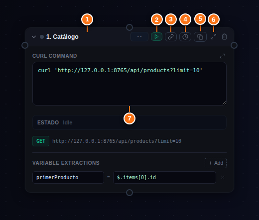
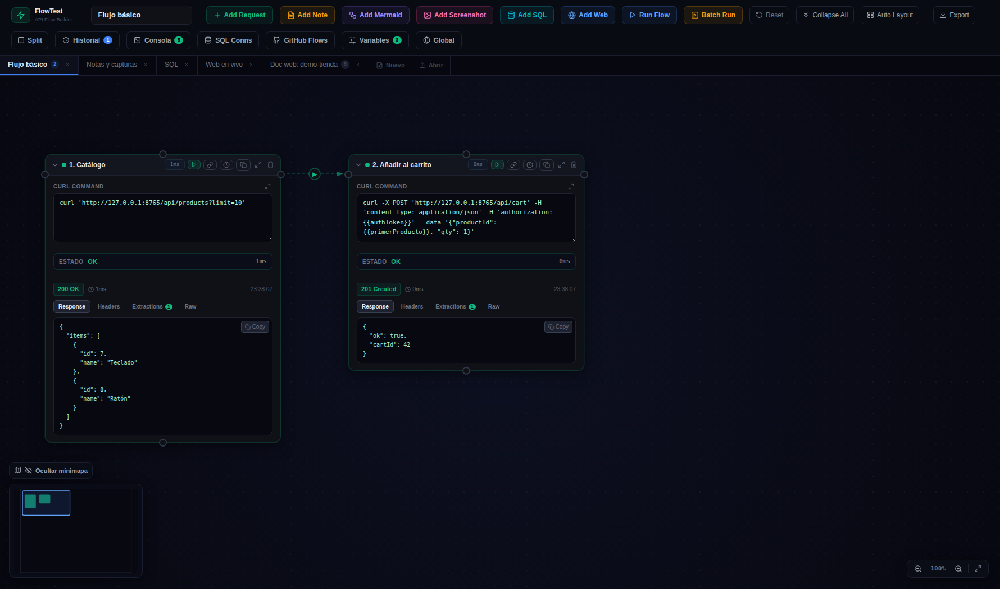
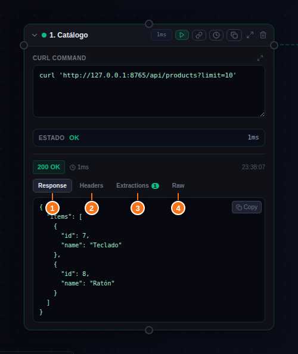
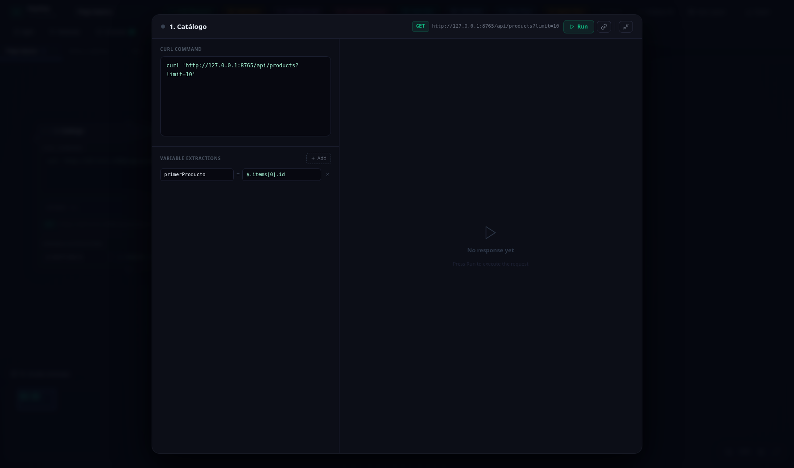

# 🟢 02 · El nodo Request (la cajita curl)

La pieza central: cada cajita verde es **una petición HTTP definida como curl**. Puedes pegar cualquier curl copiado de la pestaña Network del navegador, de Postman o de una doc de API, y funciona.

| Nº | Elemento | Qué hace |
|----|----------|----------|
| ① | Nombre | Editable inline. Ponle nombres descriptivos («1. Login», «2. Crear pedido») |
| ② | ▶ Run | Ejecuta **solo este nodo** (con sus dependencias de variables ya resueltas) |
| ③ | 🔗 Connect | Inicia una conexión: después clica el nodo destino |
| ④ | 🕐 Cron | Programa la ejecución periódica del nodo |
| ⑤ | ⧉ Copiar | Clona la cajita a otro flow (elige pestaña destino) |
| ⑥ | ⤢ Maximize | Abre el nodo a pantalla completa (ver abajo) |
| ⑦ | Editor cURL | El comando; admite `{{variables}}` y el icono ⤢ lo expande a editor grande |

Debajo del editor: la franja **ESTADO**, el badge con **método + URL** parseados, y las **VARIABLE EXTRACTIONS** (ver [03 Conexiones y variables](03-conexiones-y-variables.md)).

## Ejecutar y leer la respuesta

Al darle a **Run Flow** (o al ▶ del nodo) las cajitas se encienden por orden: ámbar ejecutando, verde OK, rojo error, con la duración en ms.

La respuesta aparece dentro de la cajita con cuatro pestañas:

| Nº | Pestaña | Contenido |
|----|---------|-----------|
| ① | **response** | Body con JSON formateado y botón Copy |
| ② | **headers** | Cabeceras de la respuesta |
| ③ | **extractions** | Variables extraídas del body con JSONPath (el badge indica cuántas) |
| ④ | **raw** | El curl **con las variables ya interpoladas** — lo que se envió de verdad. Perfecto para copiar y reproducir fuera |

## Estados y colores

| Color | Significado |
|-------|-------------|
| Gris | Idle, sin ejecutar |
| Ámbar (pulsando) | Ejecutando — muestra el tiempo transcurrido |
| Verde | Éxito (2xx) |
| Rojo | Error HTTP o de red |

## Pantalla completa

El botón ⤢ abre el nodo en un modal grande: curl y extracciones a la izquierda, respuesta con pestañas Body/Headers a la derecha. Se cierra con **Esc**.

> [!TIP]
> **CORS**
> Las peticiones no salen directas del navegador: pasan por el proxy del server (`/proxy`), así que **no hay problemas de CORS** y valen URLs internas (localhost, LAN, Docker).
