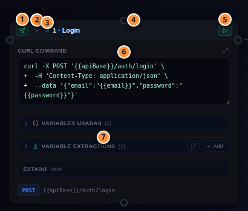
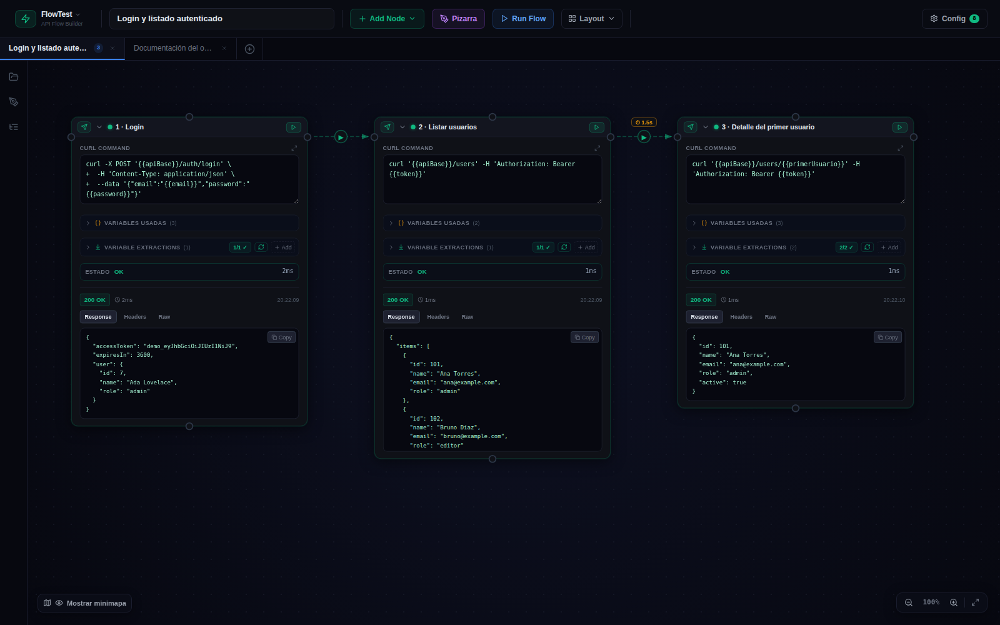
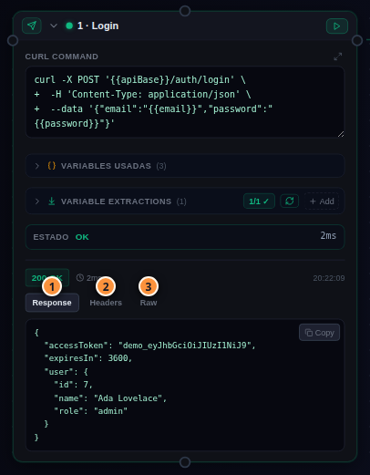
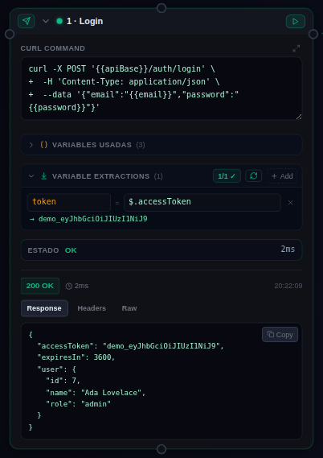
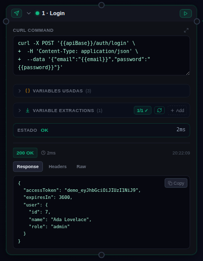
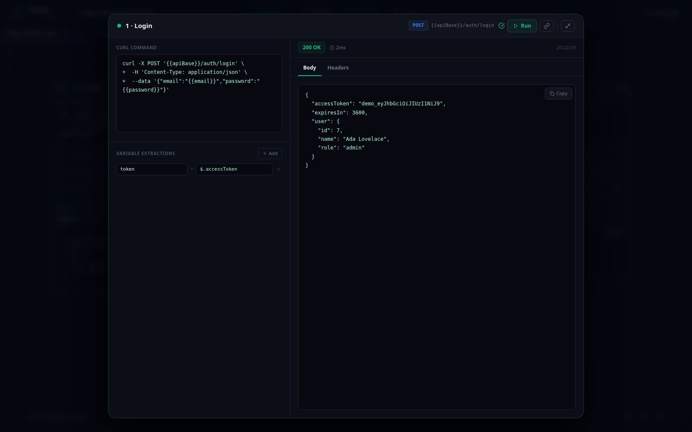
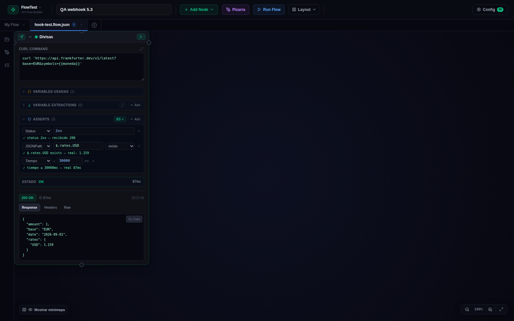

# 🟢 02 · El nodo Request (la cajita curl)

La pieza central: cada cajita verde es **una petición HTTP definida como curl**. Puedes pegar cualquier curl copiado de la pestaña Network del navegador, de Postman o de una doc de API, y funciona.

| Nº | Elemento | Qué hace |
|----|----------|----------|
| ① | Nombre | Editable inline. Ponle nombres descriptivos («1. Login», «2. Crear pedido») |
| ② | ▶ Run | Ejecuta **solo este nodo** (con sus dependencias de variables ya resueltas) |
| ③ | 🔗 Connect | Inicia una conexión: después clica el nodo destino |
| ④ | 🕐 Cron | Programa la ejecución periódica del nodo |
| ⑤ | ⧉ Copiar | Clona la cajita a otro flow (elige pestaña destino) |
| ⑥ | ⤢ Maximize | Abre el nodo a pantalla completa (ver abajo) |
| ⑦ | Editor cURL | El comando; admite `{{variables}}` y el icono ⤢ lo expande a editor grande |

Debajo del editor: la franja **ESTADO**, el badge con **método + URL** parseados, y las **VARIABLE EXTRACTIONS** (ver [03 Conexiones y variables](03-conexiones-y-variables.md)).

## Ejecutar y leer la respuesta

Al darle a **Run Flow** (o al ▶ del nodo) las cajitas se encienden por orden: ámbar ejecutando, verde OK, rojo error, con la duración en ms.

La respuesta aparece dentro de la cajita con cuatro pestañas:

| Nº | Pestaña | Contenido |
|----|---------|-----------|
| ① | **response** | Body con JSON formateado y botón Copy |
| ② | **headers** | Cabeceras de la respuesta |
| ③ | ~~extractions~~ | Desde la 4.32 las extracciones viven en la franja plegable **Variable extractions** bajo el editor (ver abajo) |
| ④ | **raw** | El curl **con las variables ya interpoladas** — lo que se envió de verdad. Perfecto para copiar y reproducir fuera |

## Variable extractions 🆕 4.32

Bajo **Variables usadas** está la franja **VARIABLE EXTRACTIONS**, con el mismo diseño plegable (plegada por defecto). En su cabecera: cuántas extracciones hay, si resuelven en la **última respuesta** (`2/2 ✓` en verde o `1 sin valor` en rojo), **Add** para añadir una fila y **↻** para **volver a extraer** de la respuesta guardada **sin repetir la llamada** — si una variable no salió porque el JSONPath estaba mal, corrígelo y pulsa ↻: el valor entra en las variables del flow al momento. Desplegada, cada fila (`varName = $.ruta`) muestra debajo el valor que resuelve ahora mismo (o «sin valor en la última respuesta»). La pestaña «extractions» de la respuesta desaparece: todo vive aquí.

## Estados y colores

| Color | Significado |
|-------|-------------|
| Gris | Idle, sin ejecutar |
| Ámbar (pulsando) | Ejecutando — muestra el tiempo transcurrido |
| Verde | Éxito (2xx) |
| Rojo | Error HTTP o de red |

## Pantalla completa

El botón ⤢ abre el nodo en un modal grande: curl y extracciones a la izquierda, respuesta con pestañas Body/Headers a la derecha. Se cierra con **Esc**.

> [!TIP]
> **CORS**
> Las peticiones no salen directas del navegador: pasan por el proxy del server (`/proxy`), así que **no hay problemas de CORS** y valen URLs internas (localhost, LAN, Docker).

## Asserts 🆕 (5.3)

Condiciones que deben cumplirse **después de la respuesta**. Si alguna falla, la caja queda en
**rojo aunque el HTTP fuera 2xx**, y el CLI sale con código ≠ 0 — pensado para CI.

La sección **Asserts** de la caja (plegable, como las extracciones) admite tres tipos:

| Tipo | Qué comprueba | Ejemplos |
|---|---|---|
| **Status** | el código HTTP | `2xx` · `200-204` · `200,201` |
| **JSONPath** | un valor del body | `$.items[0].id` con `exists`, `equals`, `not-equals`, `contains`, `gt`, `lt` |
| **Tiempo** | duración máxima | `≤ 1500 ms` |

Tras ejecutar, cada assert enseña su resultado real (`✓ status 2xx — recibido 200` /
`✗ $.rates.USD exists — real: (sin valor)`), la cabecera resume `3/3 ✓` o `1 KO`, y el fallo
también sale en la Consola y en el historial. En el CLI, los asserts KO aparecen bajo el nodo y
fuerzan `exit 1` (y en `--data`, el caso concreto queda marcado). El MCP los acepta en
`node_add_request` (`asserts: [{kind, expected|path|op|value|maxMs}]`).
