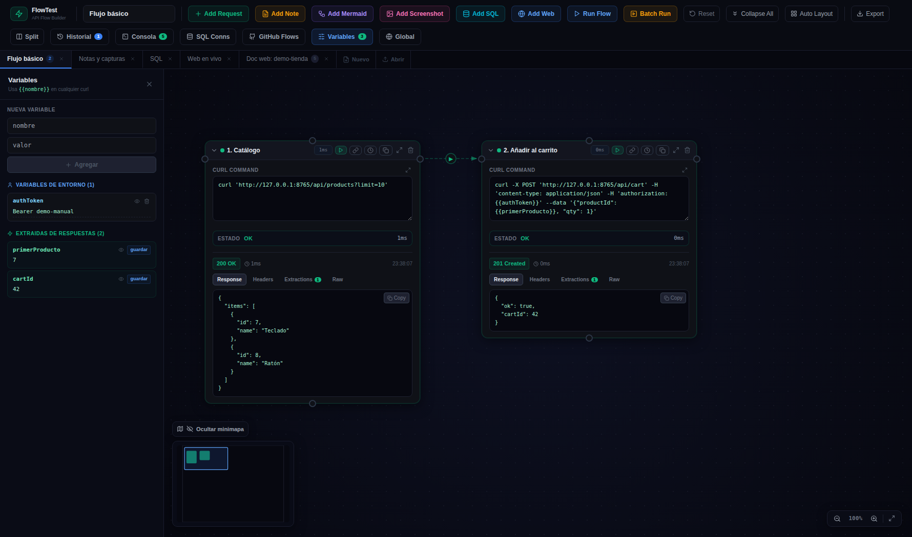
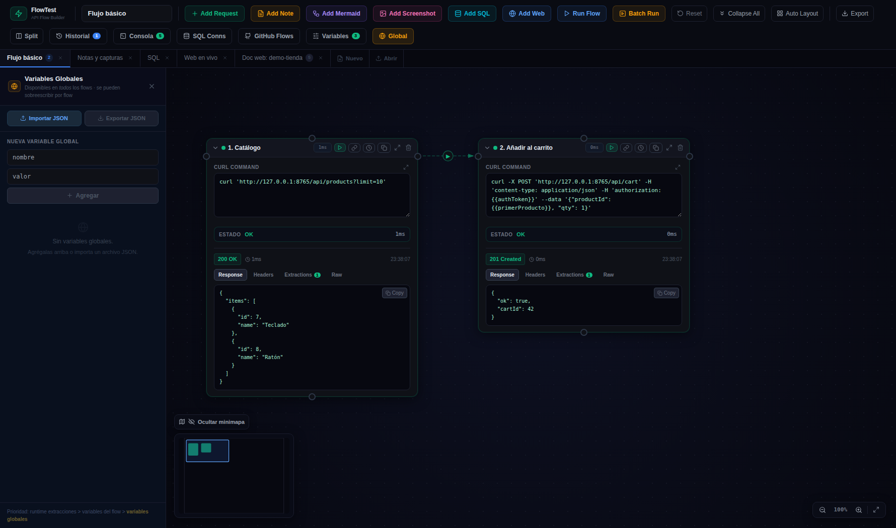

# 🔗 03 · Conexiones y variables

Los dos mecanismos que convierten cajitas sueltas en un **flujo**.

## Conectar nodos

1. Clica el botón **Connect/🔗** del nodo origen (o uno de los 4 puertos circulares de sus lados).
2. Clica el nodo destino.

La flecha define el orden: al darle a **Run Flow**, cada nodo espera a que terminen los que le apuntan (orden topológico). Los nodos sin dependencias entre sí corren **en paralelo**.

### Tipos de conexión (behavior)

Clicando sobre una conexión puedes cambiar su comportamiento:

| Behavior | Significado |
|----------|-------------|
| **next** (por defecto) | El destino corre cuando el origen termina **bien** |
| **on_error** | El destino corre **solo si** el origen falla (rutas de recuperación) |
| **parallel** | El destino arranca a la vez que el origen, sin esperar |
| **none** | Solo informativa: dibuja la relación pero **no afecta** a la ejecución. Es la que usan las capturas para colgar sus cajitas de llamadas 🆕 |

## Variables: mover datos entre cajitas

El ciclo completo, con el flujo de ejemplo:

1. **Extraer**: el nodo «1. Catálogo» define la extracción `primerProducto = $.items[0].id` — al ejecutarse, guarda en esa variable el id del primer producto de la respuesta (JSONPath sobre el body).
2. **Usar**: el nodo «2. Añadir al carrito» escribe `{{primerProducto}}` dentro de su curl (URL, headers o body, da igual) y se interpola al ejecutar.

```bash
curl -X POST 'http://.../api/cart' \
  -H 'authorization: {{authToken}}' \
  --data '{"productId": {{primerProducto}}, "qty": 1}'
```

### Los tres niveles de variables

| Nivel | Dónde vive | Para qué |
|-------|-----------|----------|
| **Entorno del flow** | Panel **Variables** (se exportan con el flow) | Config del flujo: hosts, tokens, ids fijos |
| **Runtime** | Panel **Variables** (sección runtime; se limpian al recargar) | Lo extraído durante la ejecución |
| **Globales** | Panel **Global** (compartidas entre todos los flows) | Cosas transversales: `apiBase`, tokens de entorno |



El panel **Variables** muestra las del flow activo — tras una ejecución verás también las extraídas (aquí `primerProducto`). El panel **Global**:



> [!TIP]
> **Dónde valen las `{{variables}}`**
> En los curl, en las consultas y conexiones SQL, en las URLs de los nodos Web, en el contenido de notas y diagramas Mermaid, y en las rutas de imagen de los nodos Captura. En todas partes, vaya.
