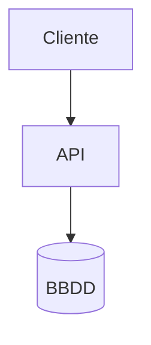

# 📝 04 · Notas, Mermaid y Capturas

Tres variantes del mismo nodo (la nota) para **documentar dentro del canvas**:

## Nota de texto (Add Note, ámbar)

Texto libre. Si escribes `{{variables}}`, muestra una **vista previa** con los valores resueltos en verde (y en ámbar las que aún no existen). La pestaña **Scripts JS** permite definir variables calculadas con JavaScript (`return "hola"` → variable disponible en el flow); la pestaña **Cron** las recalcula periódicamente.

## Diagrama Mermaid (Add Mermaid, violeta)

Escribe código [Mermaid](https://mermaid.js.org) y el diagrama se renderiza **en vivo** debajo del editor. Admite `{{variables}}` dentro del código — un diagrama que se actualiza con datos del flujo.

## Nodo Captura (Add Screenshot, rosa) 🆕

Muestra una **imagen** en el canvas. El campo de arriba acepta:

- La ruta de un screenshot generado por la app (`/flow-assets/...`) — se muestra directamente, con enlace para abrirla a tamaño completo.
- **La URL de una web** → aparece el botón **📸 Capturar**:

Al pulsar **① Capturar**, el server abre esa web con Chrome (headless), le hace un screenshot, lo guarda en `flows/assets/captures/` y la cajita pasa a mostrarlo — rellenando las notas con URL, título y fecha si estaban vacías:

Las notas de la captura (URL, fecha, qué se ve) van en el cuadro de texto de abajo y se guardan con el flow.

> [!NOTE]
> **De dónde salen las capturas «buenas»**
> Este botón hace una foto puntual. Para documentar **flujos completos** (pantalla a pantalla con sus llamadas HTTP) están el [modo Live](06-nodo-web-live.md) y [flow-explore](07-flow-explore.md), que crean estos nodos Captura automáticamente.

> [!WARNING]
> **Requiere Chrome local**
> El botón Capturar usa el Chrome de la máquina donde corre el server. En la imagen Docker no está disponible (devuelve un aviso).
