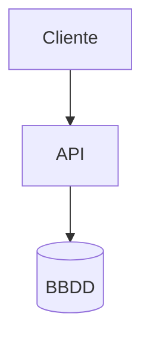

# 📝 04 · Notas, Mermaid y Capturas

Tres variantes del mismo nodo (la nota) para **documentar dentro del canvas**:

## Nota de texto (Add Note, ámbar)

Texto libre. Si escribes `{{variables}}`, la **vista previa** resuelve los valores en verde (y en ámbar las que aún no existen). Un conmutador **Vista previa / Texto** (arriba a la derecha de la pestaña) muestra uno u otro — vista previa por defecto; en los nodos Mermaid alterna entre el diagrama y el código. Desde la 4.29 la vista previa tiene un botón **Copiar** que lleva al portapapeles **toda la vista**: texto plano con las `{{variables}}` resueltas y, a la vez, HTML con los enlaces (al pegar en Slack/Word/Obsidian se conservan).

La pestaña **Scripts JS** define variables calculadas con JavaScript (`return "hola"` → variable disponible en el flow). **Desde la 4.23 esos scripts se ejecutan solos al pulsar Run Flow** (también con `flow_run` por MCP y en el CLI) y sus valores entran en el flow **antes de la primera petición** — ideal para ids, emails o tokens únicos por ejecución (`return 'qa+' + Date.now() + '@example.com'`). Precedencia en el CLI: `envVariables` < scripts < `--var`; `--skip-info-scripts` los desactiva. La pestaña **Cron** los recalcula periódicamente.

### Scripts «antes» y «después», con `vars` 🆕 (4.51)

Cada script tiene un conmutador **antes / después** en su cabecera:

- **antes** (por defecto, como hasta ahora): corre antes de la primera petición de Run Flow — ids únicos, fechas, tokens.
- **después**: corre **al terminar Run Flow**, cuando ya están todas las extracciones del run. Es el sitio para calcular a partir de los datos: deltas (`return (vars.wti - vars.wtiPrev).toFixed(2)`), semáforos (`return Number(vars.vix) > 30 ? '🔴 pánico' : '🟢 calma'`), textos resumen… Sus valores entran como variables del flow, así que una nota, un Mermaid o un texto de la pizarra los muestran con `{{variable}}`.
- Todo script recibe ahora **`vars`**: un objeto con las variables del flow en ese momento (entorno + runtime) más las de los scripts anteriores de la misma tanda. También al pulsar ▶ en la nota o en el script, y en las cadenas.
- El Historial registra cada tanda como `JS` («scripts JS (antes)» / «(después)»). En el CLI ocurre lo mismo (`--var` sigue ganando; `--skip-info-scripts` salta las dos fases) y el MCP acepta `when: "after"` en `scripts`.

🆕 4.25: en el texto, `[[otro-flow]]`, `[[otro-flow|texto]]` y `[[otro-flow#Nombre de nodo]]` se convierten en **enlaces a otros flows del proyecto** (abre el flow y centra el nodo), y las URLs `http(s)` son clicables — ver [08 · Enlaces entre flows](08-paneles.md#enlaces-entre-flows-en-las-notas--425).

## Diagrama Mermaid (Add Mermaid, violeta)

Escribe código [Mermaid](https://mermaid.js.org) y el diagrama se renderiza **en vivo**. Admite `{{variables}}` dentro del código — un diagrama que se actualiza con datos del flujo.

🆕 El botón **Maximizar** de la cabecera de la vista previa abre el diagrama **a pantalla completa**: zoom del 25 % al 400 % con los botones, `Ctrl` + rueda o `Ctrl` `+`/`-`/`0`, con scroll real cuando no cabe; `Esc` o **Cerrar** vuelve al canvas.

```mermaid
graph TD
  A[Cliente] --> B[API]
  B --> C[(BBDD)]
```

## Nodo Captura (Add Screenshot, rosa) 🆕

Muestra una **imagen** en el canvas. El campo de arriba acepta:

- La ruta de un screenshot generado por la app (`/flow-assets/...`) — se muestra directamente, con enlace para abrirla a tamaño completo.
- **La URL de una web** → aparece el botón **📸 Capturar**:

Al pulsar **① Capturar**, el server abre esa web con Chrome (headless), le hace un screenshot, lo guarda en `flows/assets/captures/` y la cajita pasa a mostrarlo — rellenando las notas con URL, título y fecha si estaban vacías:

Las notas de la captura (URL, fecha, qué se ve) van en el cuadro de texto de abajo y se guardan con el flow.

> [!NOTE]
> **De dónde salen las capturas «buenas»**
> Este botón hace una foto puntual. Para documentar **flujos completos** (pantalla a pantalla con sus llamadas HTTP) están el [modo Live](06-nodo-web-live.md) y [flow-explore](07-flow-explore.md), que crean estos nodos Captura automáticamente.

> [!NOTE]
> **Chrome**: el botón Capturar usa el Chrome de la máquina donde corre el server. Desde la **4.5.0 la imagen Docker trae Chromium**, así que funciona también dentro del contenedor.
