# 📝 04 · Notas, Mermaid y Capturas

Tres variantes del mismo nodo (la nota) para **documentar dentro del canvas**:

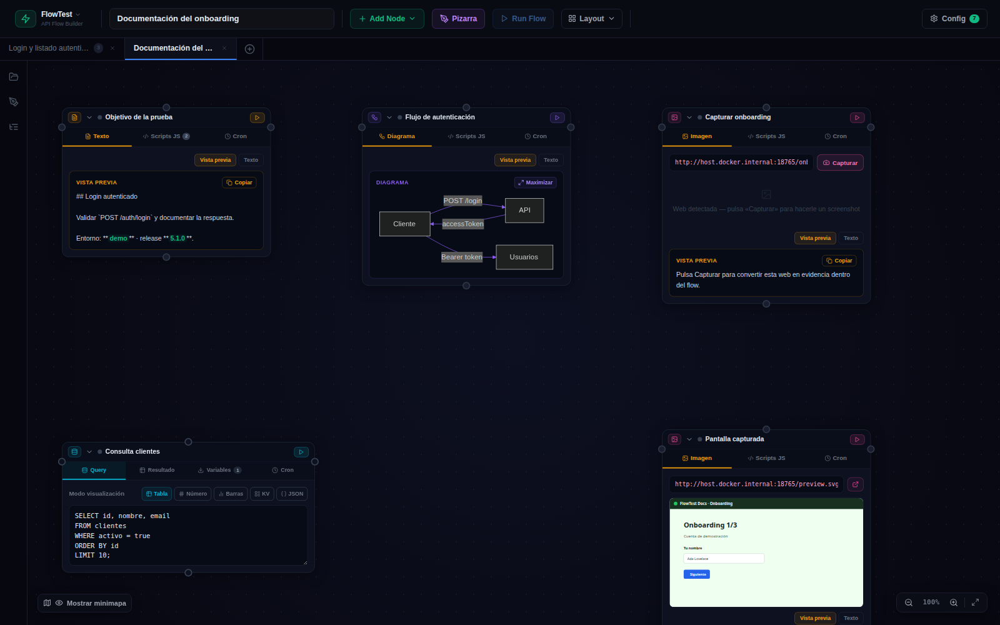

## Nota de texto (Add Note, ámbar)

Texto libre. Si escribes `{{variables}}`, la **vista previa** resuelve los valores en verde (y en ámbar las que aún no existen). Un conmutador **Vista previa / Texto** (arriba a la derecha de la pestaña) muestra uno u otro — vista previa por defecto; en los nodos Mermaid alterna entre el diagrama y el código. Desde la 4.29 la vista previa tiene un botón **Copiar** que lleva al portapapeles **toda la vista**: texto plano con las `{{variables}}` resueltas y, a la vez, HTML con los enlaces (al pegar en Slack/Word/Obsidian se conservan).

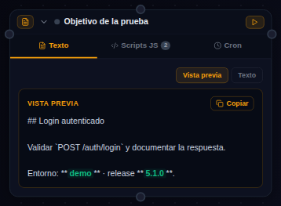

### Nota a pantalla completa 🆕 (5.16)

A la derecha de **Copiar**, el botón **Maximizar** abre la nota a pantalla completa — para leer una nota larga sin estirar la caja ni hacer zoom en el lienzo:

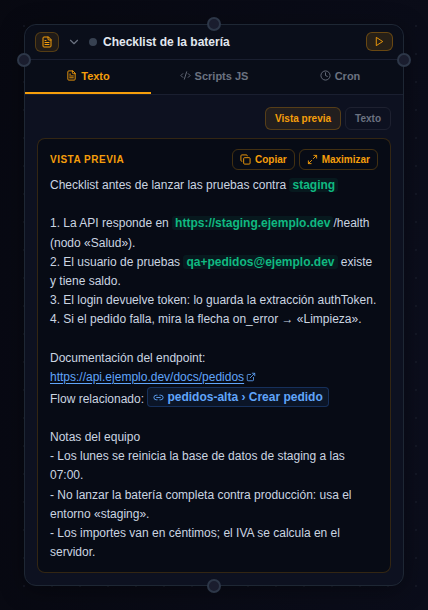

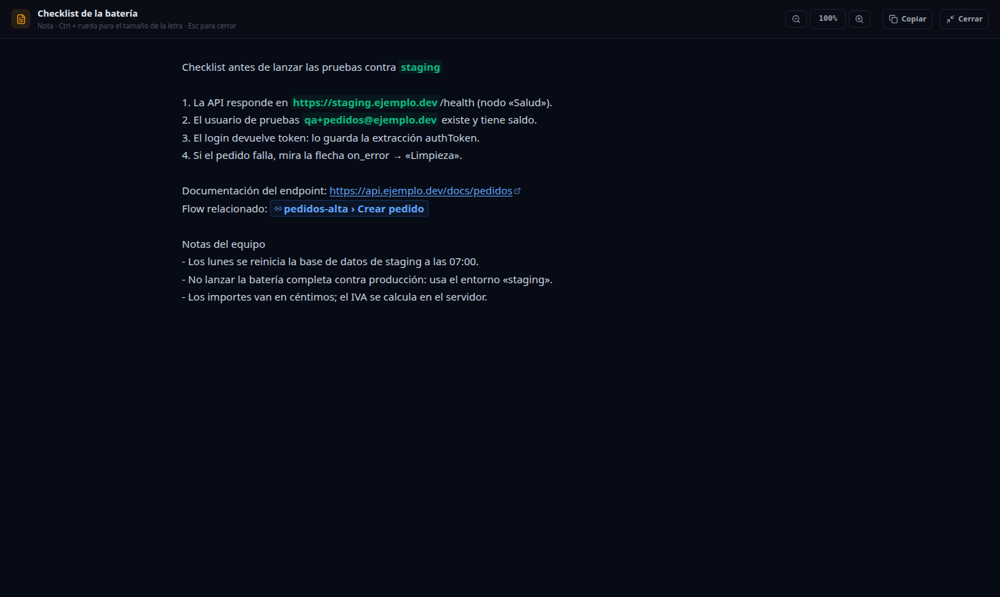

- Se ve **como en la vista previa**: `{{variables}}` resueltas, URLs clicables y enlaces `[[flow]]` / `[[flow#Nodo]]` — al seguir uno, la nota se cierra y la app navega al flow.
- **Tamaño de la letra**: botones − / % / + de la barra, **Ctrl + rueda** o `Ctrl +` / `Ctrl −` / `Ctrl 0` (de 60 % a 300 %).
- **Copiar** copia la nota entera (texto plano + HTML, igual que el botón de la caja). **Esc** o **Cerrar** vuelven al lienzo.
- En una **Captura**, la imagen sale encima del texto. Los diagramas Mermaid tienen su propio «Maximizar diagrama» con zoom.
- También está en el menú de la caja (icono del tipo ▸ **Maximizar nota**), que funciona aunque la nota esté plegada.

La pestaña **Scripts JS** define variables calculadas con JavaScript (`return "hola"` → variable disponible en el flow). **Desde la 4.23 esos scripts se ejecutan solos al pulsar Run Flow** (también con `flow_run` por MCP y en el CLI) y sus valores entran en el flow **antes de la primera petición** — ideal para ids, emails o tokens únicos por ejecución (`return 'qa+' + Date.now() + '@example.com'`). Precedencia en el CLI: `envVariables` < scripts < `--var`; `--skip-info-scripts` los desactiva. La pestaña **Cron** los recalcula periódicamente.

### Scripts «antes» y «después», con `vars` 🆕 (4.51)

Cada script tiene un conmutador **antes / después** en su cabecera:

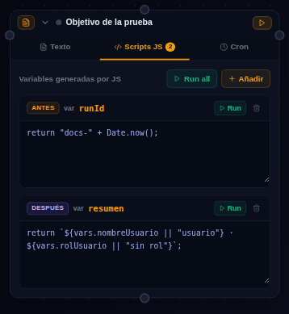

- **antes** (por defecto, como hasta ahora): corre antes de la primera petición de Run Flow — ids únicos, fechas, tokens.
- **después**: corre **al terminar Run Flow**, cuando ya están todas las extracciones del run. Es el sitio para calcular a partir de los datos: deltas (`return (vars.wti - vars.wtiPrev).toFixed(2)`), semáforos (`return Number(vars.vix) > 30 ? '🔴 pánico' : '🟢 calma'`), textos resumen… Sus valores entran como variables del flow, así que una nota, un Mermaid o un texto de la pizarra los muestran con `{{variable}}`.
- Todo script recibe ahora **`vars`**: un objeto con las variables del flow en ese momento (entorno + runtime) más las de los scripts anteriores de la misma tanda. También al pulsar ▶ en la nota o en el script, y en las cadenas.
- El Historial registra cada tanda como `JS` («scripts JS (antes)» / «(después)»). En el CLI ocurre lo mismo (`--var` sigue ganando; `--skip-info-scripts` salta las dos fases) y el MCP acepta `when: "after"` en `scripts`.

### Scripts que dibujan botones, páginas y acciones 🆕 (5.14)

Un script de nota es JavaScript que corre **dentro de la página de FlowTest** cuando ejecutas el flow (`new Function('vars', código)`), con los mismos permisos que la app — desde la 5.15, solo en los **flows de confianza**; los demás corren en un sandbox sin página (ver [más abajo](#sandbox-y-flows-de-confianza--515)). Además de devolver variables, puede **dibujar interfaz**: colgar del `document.body` una barra de botones, abrir una «página» (un `<dialog>` con pestañas), abrir una pestaña nueva del navegador con un informe (`window.open` + `document.write`), descargar un fichero (`Blob` + `<a download>`), copiar al portapapeles y, al pulsar un botón, **hablar con tu propia instalación** llamando al MCP embebido desde la página:

```js
const r = await fetch('/mcp', { method: 'POST',
  headers: { 'Content-Type': 'application/json', Accept: 'application/json, text/event-stream' },
  body: JSON.stringify({ jsonrpc: '2.0', id: Date.now(), method: 'tools/call',
    params: { name: 'flow_run', arguments: {} } }) });   // o variables_set, flow_open, node_update…
```

El endpoint acepta llamadas sueltas sin sesión; `Accept` debe incluir `text/event-stream`. Si la instalación lleva `FLOW_MCP_TOKEN`, añade `Authorization: Bearer …` y haz que el botón lo diga si falla, en vez de callar.

Ejemplos listos en la galería: **Scripts 04 · Divisas** (barra de botones, diálogo con conversor y pestañas, informe en pestaña nueva, CSV, copiar y ▶ que reejecuta el flow) y **Scripts 05 · Tiempo** (botones que escriben Variables y relanzan el flow).

**El contrato de un script que dibuja** (lo que lo convierte en herramienta y no en trampa):

1. **Guardas**: `if (typeof document === 'undefined') return 'CLI: sin interfaz'` (el CLI y los monitores no tienen página) y sin datos no dibuja nada.
2. **Una sola instancia**: id fijo y `document.getElementById(ID)?.remove()` antes de crearse; como corre «después» de cada Run Flow, se redibuja con los datos nuevos.
3. **Shadow DOM** (`host.attachShadow({ mode: 'open' })`): sus estilos no pisan los de la app ni al revés.
4. **Nada persistente ni automático**: sin `localStorage`, sin `Notification`, sin `setInterval`, sin relanzar el flow por su cuenta. Cada acción es un clic del usuario; para ejecutar solo está el Monitor.
5. **Botón ✕** siempre activo que quita el panel, y `return` de un texto de estado para que la nota diga qué pasó.
6. El panel es de la página, no de la pestaña: sigue ahí al cambiar de flow hasta que lo quitas o reejecutas.

**Lo que no cambia**: el `.flow.json` sigue siendo un fichero de datos y la app no se modifica. La otra cara: un flow que te pasen puede ejecutar código en tu navegador — por eso desde la 5.15 los flows que no son tuyos corren sus scripts en un **sandbox** hasta que tú decides confiar (sección siguiente). Si repartes flows a gente que no los va a leer, quita los scripts o mantén una copia sin ellos.

**Cómo llegan los datos al script**: las extracciones convierten lo que sacan en texto (`String(valor)`): un array queda como `"v1,v2,…"` (un array de pares como `[[ts, precio], …]` se aplana a `"ts,precio,ts,precio…"`) y un objeto como `[object Object]`. Extrae números, textos o arrays de primitivos y parsea en el script (`String(vars.x).split(',').map(Number)`).

🆕 4.25: en el texto, `[[otro-flow]]`, `[[otro-flow|texto]]` y `[[otro-flow#Nombre de nodo]]` se convierten en **enlaces a otros flows del proyecto** (abre el flow y centra el nodo), y las URLs `http(s)` son clicables — ver [08 · Enlaces entre flows](08-paneles.md#enlaces-entre-flows-en-las-notas--425).

### Sandbox y flows de confianza 🆕 (5.15)

Un script de nota es código. Hasta la 5.14 corría siempre en la página, así que un flow que te pasaran podía hacer en tu navegador lo mismo que tú: leer y cambiar tu canvas por el MCP, guardar ficheros del proyecto, pintar cualquier cosa sobre la app. Desde la 5.15 la app distingue dos casos:

- **🛡️ Flows de confianza**: los que nacen en esta pestaña (Nuevo flow, los que construye el asistente de IA o el MCP con `flow_create`) y los que marcas tú. Sus scripts corren en la página, como siempre: pueden dibujar interfaz y llamar al MCP.
- **🔒 Todo lo demás** — abierto desde el panel Proyecto (disco o cloud), «Abrir .flow.json…», importado o de la galería: sus scripts corren en un **sandbox**: un iframe de origen opaco (sin cookies ni sesión, sin el DOM de la app, sin `localStorage`), con una CSP sin red (ni `fetch`, ni XHR, ni WebSocket) y dentro de un Worker con tope de tiempo (5 s: un bucle infinito se corta y no congela la app). El script recibe una **copia** de `vars`, devuelve su valor y nada más. Para los scripts que solo calculan (`return Number(vars.total) > 0 ? 'OK' : 'VACÍO'`) no cambia nada.

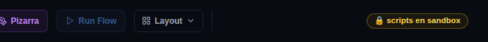

El **chip de la barra superior** dice en qué estado está la pestaña: **🔒 scripts en sandbox** o **🛡️ flow de confianza**. Clic para cambiarlo (al conceder confianza pide confirmación; solo aparece en pestañas de flow, no en documentos).

**Cuando un script necesita la página.** Si el código de un script de un flow no confiable usa `document`, `window`, `fetch`, `localStorage`, `Notification`… la app lo detecta **antes de ejecutarlo** (5.15.1) y pregunta:

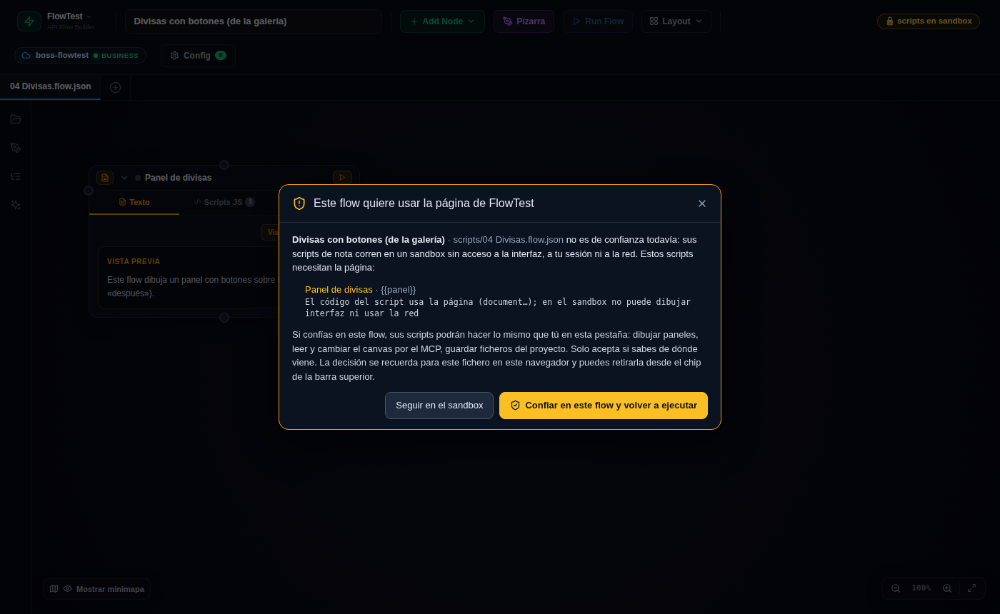

- **Confiar en este flow y volver a ejecutar**: el flow pasa a ser de confianza, el script se ejecuta en la página y a partir de ahora todos los de ese flow también.
- **Seguir en el sandbox**: ese script (y los que pidan la página en la misma pestaña) devuelven un error explicativo en la nota, y no se vuelve a preguntar hasta que reabras el flow o toques el chip. Un script que ya corría en el sandbox y falla intentando usar la red o el DOM también dispara la pregunta.

La decisión se guarda **por fichero y por navegador** (`localStorage`, clave `local:` o `cloud:` + ruta), nunca dentro del `.flow.json`: compartir el flow no comparte tu confianza, y la misma ruta en local y en el cloud se decide por separado. Retirarla es un clic en el chip.

**Cuándo confiar.** Acepta si sabes de dónde viene el flow: lo hiciste tú, lo hizo tu equipo, o es de la galería y lo has leído. Un script que dibuja y sigue el contrato de arriba es una herramienta; el mismo script en un flow ajeno puede llevar cualquier cosa. En el servidor (CLI, móvil, webhooks, monitores) los scripts siguen corriendo en el sandbox `vm` de la 5.14.1, sin acceso a la página ni a los secretos del contenedor — y allí no se pregunta nada: un script no puede dibujar sin navegador.

## Diagrama Mermaid (Add Mermaid, violeta)

Escribe código [Mermaid](https://mermaid.js.org) y el diagrama se renderiza **en vivo**. Admite `{{variables}}` dentro del código — un diagrama que se actualiza con datos del flujo.

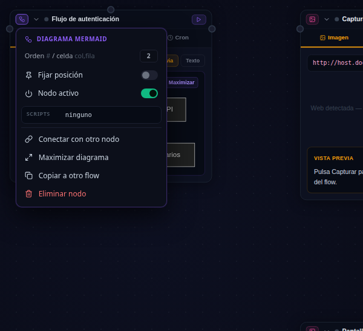

🆕 El botón **Maximizar** de la cabecera de la vista previa abre el diagrama **a pantalla completa**: zoom del 25 % al 400 % con los botones, `Ctrl` + rueda o `Ctrl` `+`/`-`/`0`, con scroll real cuando no cabe; `Esc` o **Cerrar** vuelve al canvas.

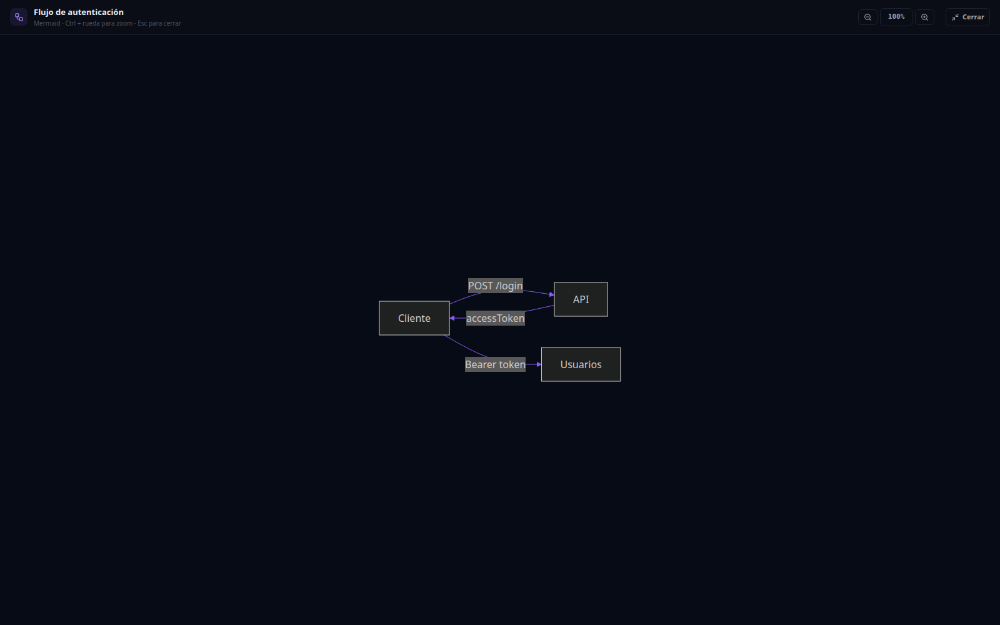

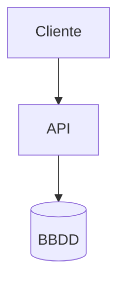
```mermaid
graph TD
  A[Cliente] --> B[API]
  B --> C[(BBDD)]
```

## Nodo Captura (Add Screenshot, rosa) 🆕

Muestra una **imagen** en el canvas. El campo de arriba acepta:

- La ruta de un screenshot generado por la app (`/flow-assets/...`) — se muestra directamente, con enlace para abrirla a tamaño completo.
- **La URL de una web** → aparece el botón **📸 Capturar**:

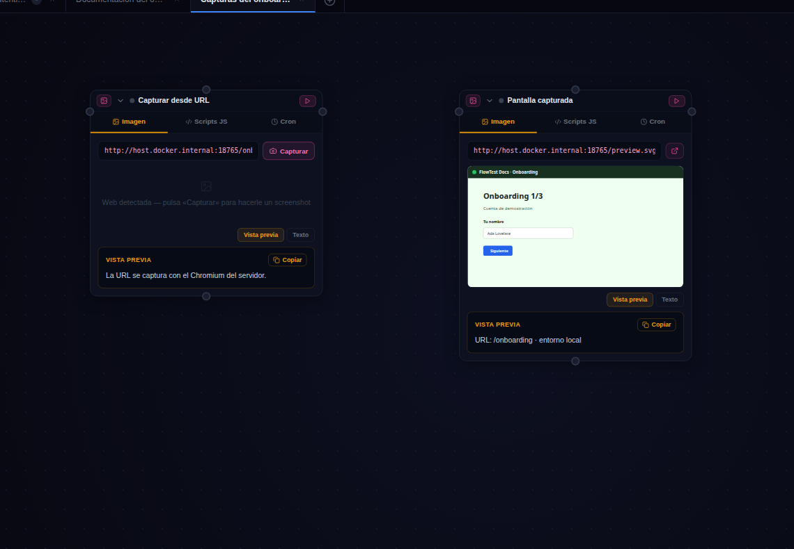

Al pulsar **① Capturar**, el server abre esa web con Chrome (headless), le hace un screenshot, lo guarda en `flows/assets/captures/` y la cajita pasa a mostrarlo — rellenando las notas con URL, título y fecha si estaban vacías:

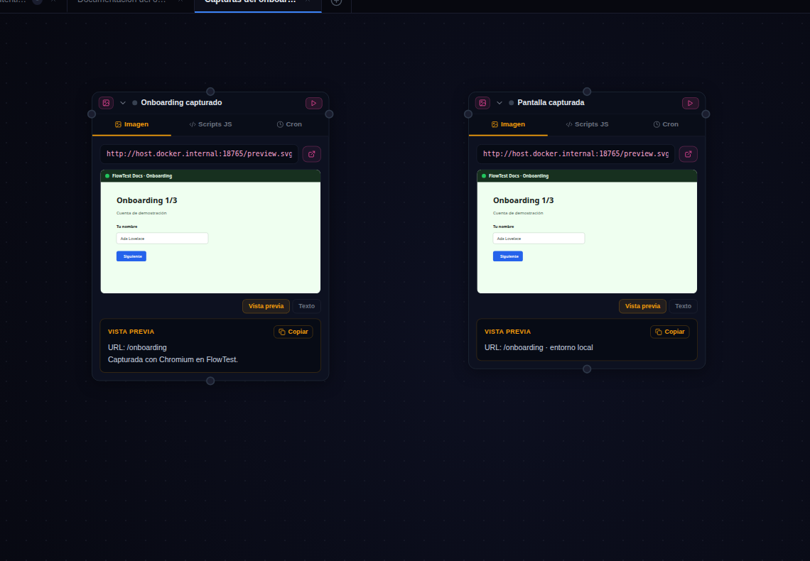

Las notas de la captura (URL, fecha, qué se ve) van en el cuadro de texto de abajo y se guardan con el flow.

> [!NOTE]
> **De dónde salen las capturas «buenas»**
> Este botón hace una foto puntual. Para documentar **flujos completos** (pantalla a pantalla con sus llamadas HTTP) están el [modo Live](06-nodo-web-live.md) y [flow-explore](07-flow-explore.md), que crean estos nodos Captura automáticamente.

> [!NOTE]
> **Chrome**: el botón Capturar usa el Chrome de la máquina donde corre el server. Desde la **4.5.0 la imagen Docker trae Chromium**, así que funciona también dentro del contenedor.
