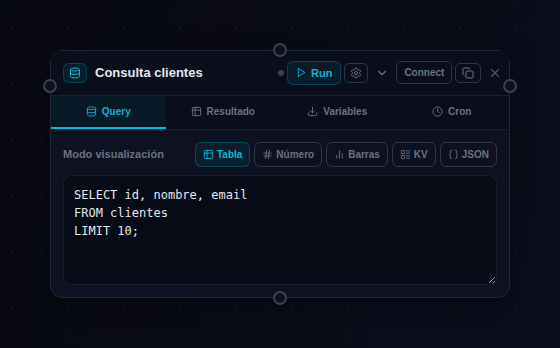
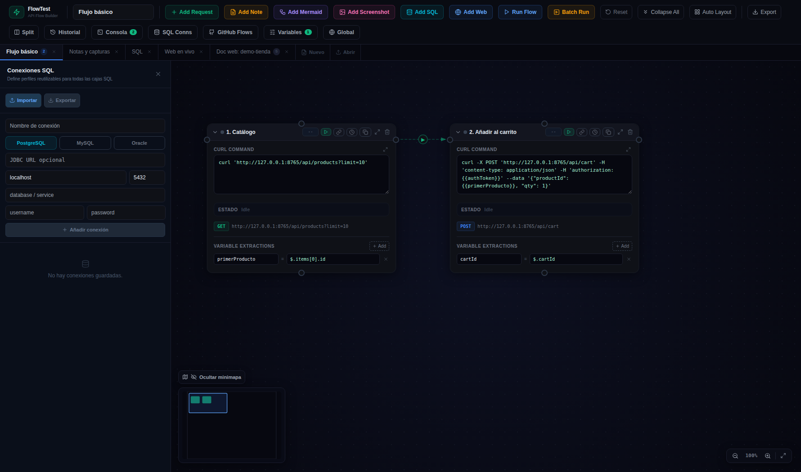

# 🗄 05 · El nodo SQL

Consultas a base de datos **dentro del flujo**, en el mismo orden topológico que las cajitas HTTP: siembra datos antes de llamar a la API, o verifica después lo que la API escribió.

## Configuración

- **Motor**: Postgres, MySQL u Oracle (drivers `pg`, `mysql2`, `oracledb` en el server — la query nunca sale del backend, sin CORS ni credenciales en el navegador).
- **Conexión**: campos host/puerto/BD/usuario/contraseña, una URL JDBC (`jdbc:postgresql://...`), o un **perfil guardado**.
- **Query**: admite `{{variables}}` tanto en la consulta como en la conexión.

## Perfiles de conexión (SQL Conns)

El botón **SQL Conns** de la toolbar guarda conexiones reutilizables — defines «BBDD staging» una vez y los nodos la referencian:

En disco, los perfiles para el CLI viven en `flows/sql-connections.json` (misma estructura).

## Resultado y modos de vista

El resultado se muestra según el **display mode**: tabla, número suelto (para `SELECT count(*)`), barras, clave-valor o JSON crudo.

## Extraer variables

Igual que los request pero **por columna**: `varName + columna + fila` → el valor queda disponible como `{{varName}}` para los nodos siguientes. Ejemplo clásico:

1. SQL: `SELECT id FROM users WHERE email='test@x.com'` → extrae `userId`.
2. Request: `curl http://api/users/{{userId}}/orders`.

> [!TIP]
> **También en el CLI**
> `flow-run` ejecuta los sqlNodes exactamente igual (perfiles vía `--sql-connections` o el `sql-connections.json` más cercano). Ojo: eso significa que un batch (`--dir flows`) **toca las BBDD de verdad** — usa `--skip-sql-nodes` si no quieres.
