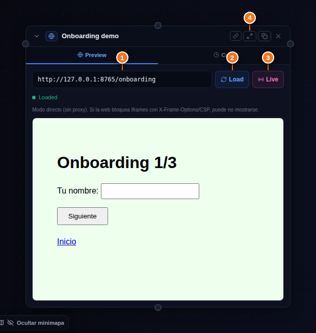
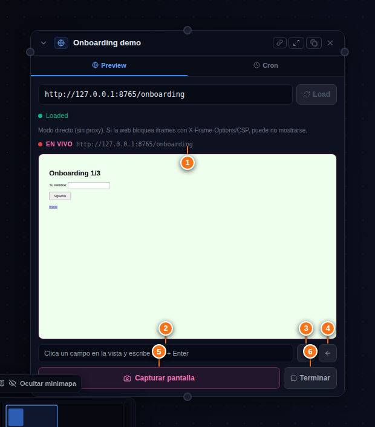
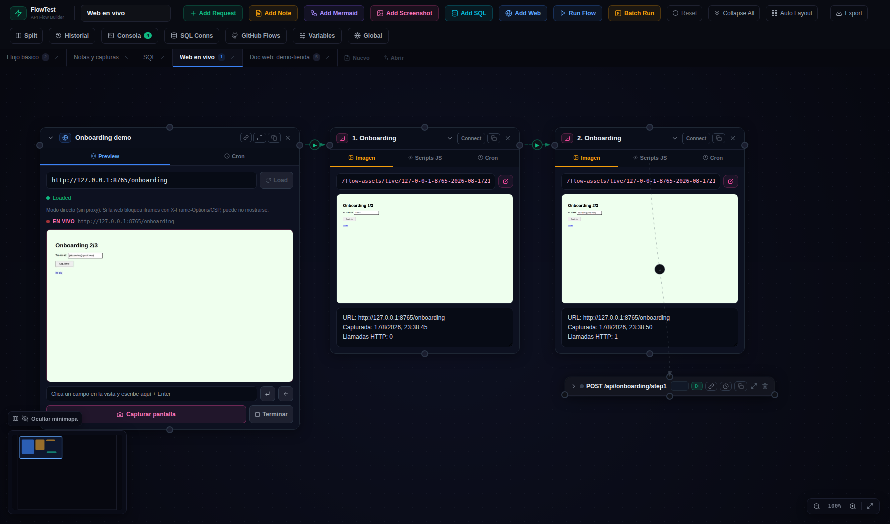
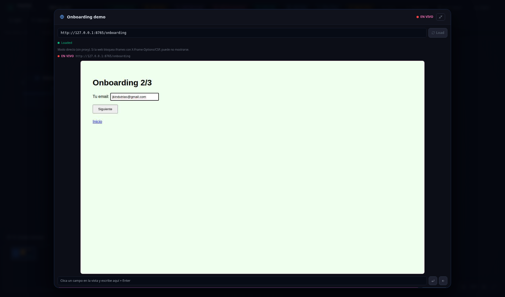

# 🌐 06 · El nodo Web y el modo Live

El nodo azul muestra una web en el canvas. Tiene dos modos: **Preview** (un iframe de toda la vida) y el **modo Live** 🆕, que es la joya: navegas una web *de verdad* dentro de la cajita y documentas cada paso con un click.

## El nodo y sus botones

| Nº | Elemento | Qué hace |
|----|----------|----------|
| ① | URL | La web a mostrar (admite `{{variables}}`) |
| ② | Load | Carga/recarga el **iframe** clásico. Ojo: muchas webs bloquean iframes (X-Frame-Options/CSP) |
| ③ | **Live** 🆕 | Abre la web en una **sesión navegable** en el server (ver abajo) |
| ④ | ⤢ Maximizar 🆕 | La cajita a pantalla completa (Esc para volver) — imprescindible con Live |

## El modo Live: navegar y capturar

Al pulsar **Live**, el server abre la URL con su propio Chrome (headless) y la cajita se convierte en un **navegador remoto**: ves frames en vivo y todo lo que haces se reenvía a esa sesión. Como es *un* navegador real con *una* sesión, **login, cookies y estado se conservan** entre pasos — justo lo que necesita un onboarding o un wizard.

| Nº | Elemento | Qué hace |
|----|----------|----------|
| ① | La vista | **Clica directamente sobre ella**: el click se reproduce en la web (reescalado exacto). La rueda hace scroll. Arriba, el punto rojo EN VIVO y la URL actual |
| ② | Campo de texto | Clica un campo en la vista para enfocarlo, escribe aquí y **Enter**: se teclea en la web |
| ③ | ⏎ | Pulsa Enter en la web (enviar formularios) |
| ④ | ← | Volver atrás |
| ⑤ | **📸 Capturar pantalla** | La estrella: crea un **nodo Captura** con el screenshot del momento **+ las cajitas curl de las llamadas HTTP** ocurridas desde la captura anterior |
| ⑥ | Terminar | Cierra la sesión del server |

## El flujo de trabajo para documentar un proceso

1. **Add Web** → URL → **Live** (y ⤢ Maximizar para trabajar cómodo).
2. Navega/rellena el paso: click en el campo → escribir + Enter → **cuando la pantalla muestre lo que quieres documentar → 📸 Capturar pantalla**.
3. Avanza (click en «Siguiente», enlace, etc.) y repite.
4. **Terminar** al acabar.

Cada captura aparece **encadenada a la anterior** (web → 1 → 2 → 3…) con sus llamadas colgando debajo como cajitas colapsadas re-ejecutables:

> [!TIP]
> **Captura ANTES de avanzar**
> Si capturas después de pulsar «Siguiente», la foto sale del paso nuevo (vacío). Captura con el formulario relleno y luego avanza — la llamada del «Siguiente» caerá en la ventana de la captura siguiente.

Maximizada, la vista Live se ve a tamaño casi real:

## Detalles que conviene saber

- **Seguridad**: en las cajitas generadas, el header `Authorization` se enmascara como `{{authToken}}` (variable creada en el flow) y las cookies **no se escriben**. Nunca quedan tokens reales en el `.flow.json`.
- Las sesiones Live inactivas **se cierran solas a los 10 minutos**.
- Los screenshots van a `flows/assets/live/<sesión>/` y se sirven como `/flow-assets/...`.
- Requiere Chrome en la máquina del server → desde la **4.5.0 la imagen Docker lo trae** (Chromium embebido). Para webs tras un login/SSO (Cloudflare Access, etc.), pasa las credenciales con `FLOW_CAPTURE_COOKIES` / `FLOW_CAPTURE_HEADERS` — ver [11-docker.md](11-docker.md).
- Desde la **4.6.0** el Live usa un **perfil de Chromium persistente** (`flows/.chrome-profile`): haces el login/OTP una vez y sobrevive al cierre por inactividad e incluso a un restart del contenedor. `FLOW_CHROME_PROFILE=off` para perfil efímero. ⚠ Ese directorio guarda cookies vivas — no lo compartas.
- También desde la 4.6.0: **barra de URL** en la sesión (ir a otra página sin cerrarla), botón de **pegar del portapapeles** (el OTP sin teclearlo carácter a carácter), y los **fallos de navegación se pintan** en la tarjeta (`errorCode` + dónde se quedó la sesión) en vez de quedarse mudos en los logs.
- Si el modo directo (iframe) es imposible (`X-Frame-Options`/`frame-ancestors`), la tarjeta lo dice **nombrando al host que bloquea** — que tras un redirect puede ser el SSO (p. ej. `*.cloudflareaccess.com`), no tu URL — y ofrece abrir en Live.
- Si una captura sale sin datos o sin llamadas, revisa el orden del tip de arriba.
