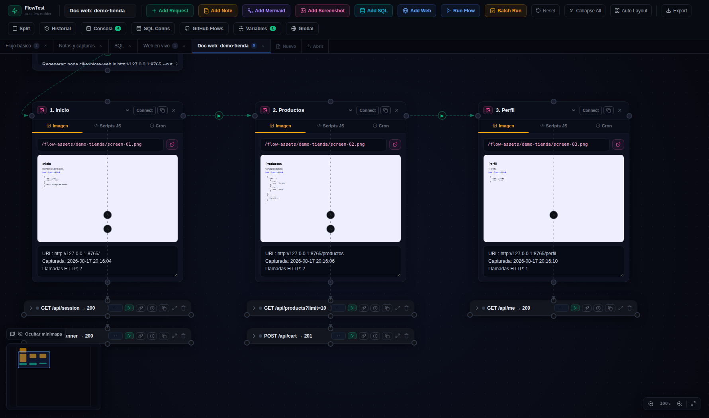
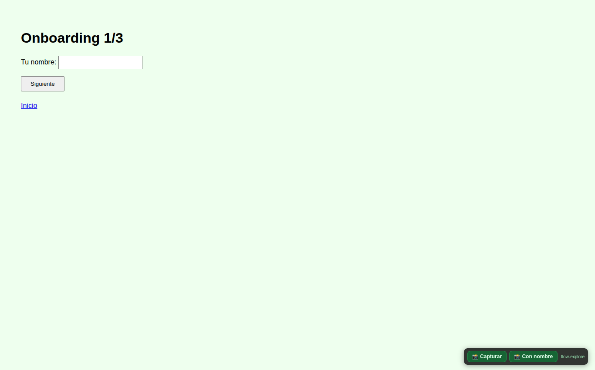

# 🕷 07 · Documentar una web — flow-explore

`flow-explore` es el CLI que documenta una web **navegándola**: abre Chrome, hace screenshot de cada pantalla, captura las llamadas HTTP que se producen en cada una, y genera la documentación en dos formatos a la vez:

- **`flows/<slug>.flow.json`** — un canvas documental: un nodo Captura por pantalla + sus cajitas curl re-ejecutables debajo. Se abre con **Abrir** en la web.
- **`flows/assets/<slug>/README.md`** — informe markdown con los screenshots, tabla de llamadas por pantalla y el detalle (curl + bodies) desplegable.

Así queda el flow documental en el canvas:



## Modo crawl (automático)

Sigue los enlaces del **mismo origen** hasta el límite indicado. Ideal para el «mapa» de una web pública:

```bash
cd flow-test
npm run flow:explore -- https://mi-web.com
node cli/explore-web.js https://mi-web.com --max-pages 5 --depth 2 --out mi-web
```

## Modo manual (tú navegas)

Para procesos con **sesión**: login, onboarding, wizards. Abre un Chrome visible y navegas tú; la herramienta lo registra todo:

```bash
npm run flow:explore -- https://mi-web.com/onboarding --manual --filter /api/
```



- Cada **cambio de URL** crea una pantalla automáticamente.
- Para pasos que **no cambian la URL** (formularios multi-paso, modales): botones **📸 Capturar** / **📸 Con nombre** de la esquina inferior derecha (atajos F8/F9). «Con nombre» te pide el título del paso.
- **Cerrar el navegador** (o ENTER en la terminal) termina y genera la documentación.

## Flags útiles

| Flag | Qué hace |
|------|----------|
| `--manual` | Modo manual (Chrome visible, sesión única) |
| `--filter <substr>` | Solo documenta llamadas cuya URL contenga eso (repetible). P. ej. `--filter /api/` |
| `--max-pages N` / `--depth N` | Límites del crawl (defecto 8 páginas, profundidad 2) |
| `--all-requests` | Captura también estáticos (css/js/img), no solo xhr/fetch |
| `--max-calls N` | Máximo de cajitas por pantalla (defecto 15; el resto se anota) |
| `--full-page` | Screenshots de la página completa, no solo el viewport |
| `--out <slug>` | Nombre base de la salida (defecto: el host) |
| `--chrome <ruta>` | Ejecutable de Chrome (o variable `FLOW_CHROME`) |
| `--viewport WxH`, `--settle ms`, `--timeout ms`, `--headful` | Ajustes finos |

## Seguridad

Los headers sensibles se **enmascaran** antes de escribir nada a disco: `authorization` → `{{authToken}}` (variable en el flow, con placeholder), y `cookie`/`x-api-key`/etc. se eliminan. El informe markdown tampoco lleva tokens.

> [!NOTE]
> **Dónde funciona**
> Necesita `puppeteer-core` (devDependency: `npm install` en el repo) y un Chrome local. No funciona dentro de la imagen Docker. La carpeta `flows/assets/` está en `.gitignore`: la documentación se regenera cuando quieras.
