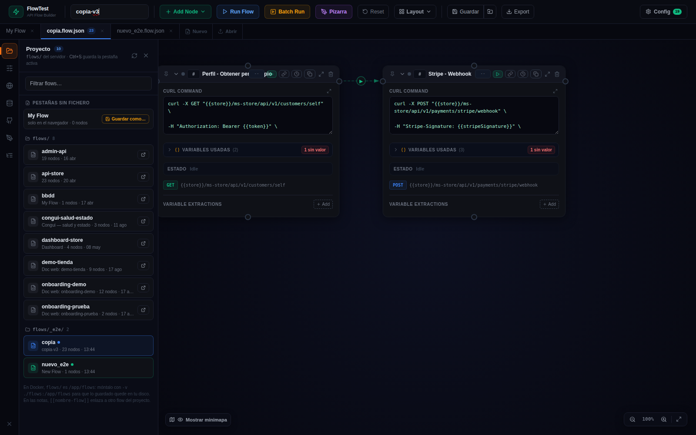
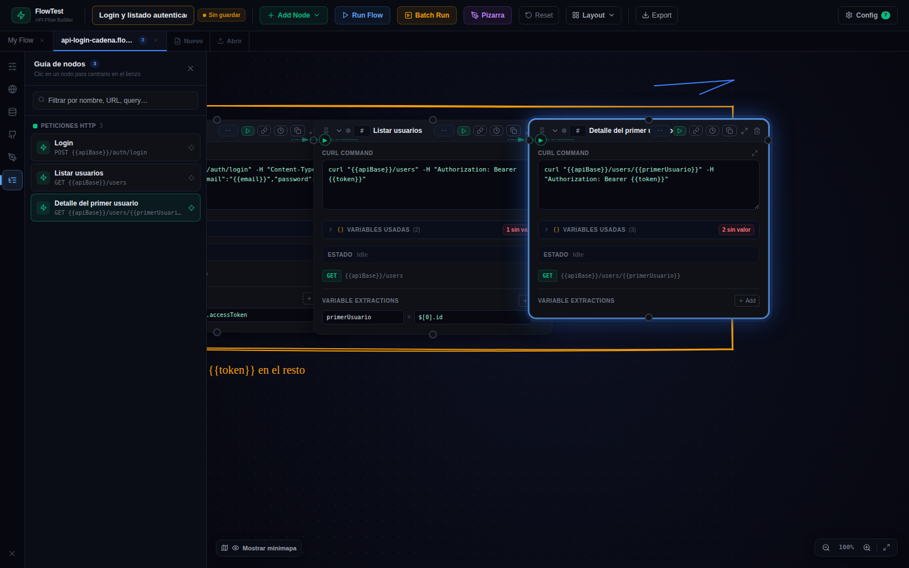
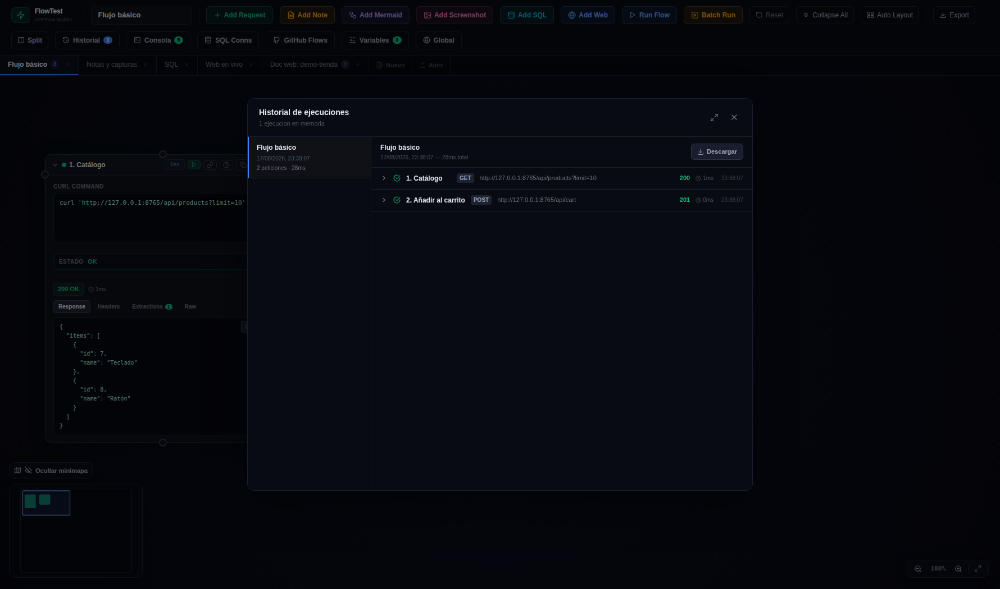
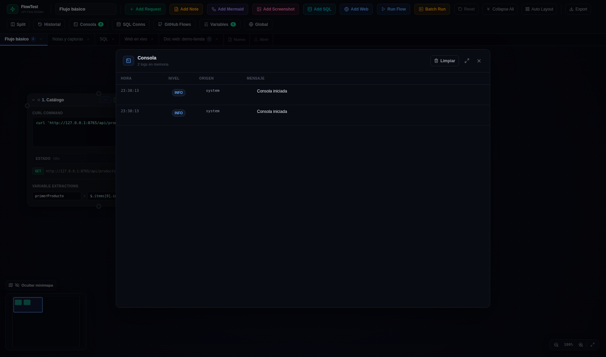
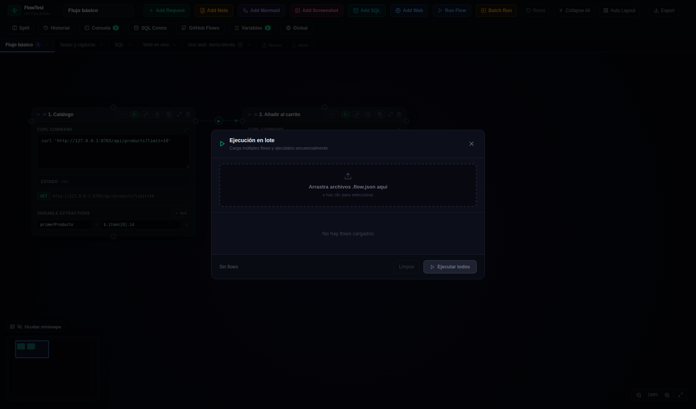
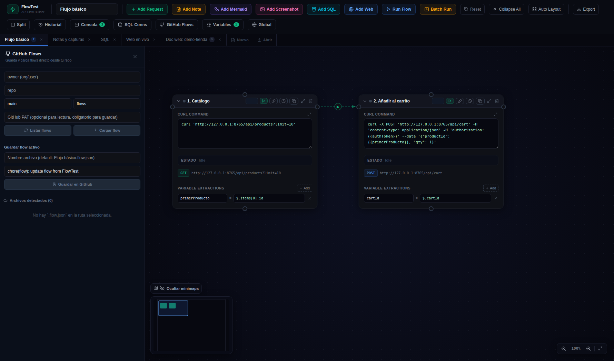

# 🧰 08 · Paneles y utilidades

> [!TIP]
> **¿Dónde está cada cosa?** **Proyecto**, **Pizarra** y **Guía de nodos** viven en la **barra lateral de iconos**; Historial, Consola, Batch, GitHub, Variables, Global y SQL Conns se abren desde **Config** (los paneles laterales aparecen en la barra mientras están abiertos; un panel a la vez); y las utilidades de organización desde el desplegable **Layout**. Ver [01 La pantalla principal](01-pantalla-principal.md).

## Proyecto — `flows/` como workspace 🆕 (4.25)

La carpeta `flows/` del servidor es el **proyecto** — en Docker `/app/flows`, así que **apúntala a una carpeta tuya** con `-v /tu/carpeta:/app/flows` (o monta donde quieras y fija `FLOW_FLOWS_DIR=/esa/ruta`; en local, `FLOW_FLOWS_DIR=/tu/carpeta npm run dev`). El panel muestra la ruta efectiva en su cabecera. El primer icono de la barra lateral abre el panel **Proyecto**:

| Zona | Qué hay |
|------|---------|
| **Pestañas sin fichero** | Pestañas creadas con *Nuevo* o importadas con *Abrir* que aún no viven en `flows/` — botón **Guardar como…** |
| **flows/** (y subcarpetas) | Cada `.flow.json` con su nombre de flow, nº de nodos y fecha. Las carpetas se **pliegan** con un clic en su cabecera (se recuerda; botón plegar/desplegar todo junto al filtro; plegada, muestra si tiene abiertos o cambios). Marcas: azul = pestaña activa, verde = abierto, **●** = cambios sin guardar, ⚠ = el fichero cambió en disco después de abrirlo (CLI, MCP, git…) |
| Botones por fichero | Abrir en una pestaña · ir a la pestaña si ya está abierto · **Guardar** (si tiene cambios) · **Recargar desde disco** (si cambió fuera) · **✕ Cerrar la pestaña** (si está abierto; confirma si tiene cambios) · **🗑 Borrar el fichero** del disco (con confirmación; cierra la pestaña si estaba abierto) |

Cómo se trabaja:

- **Abrir**: clic en un fichero → pestaña con la etiqueta del fichero. Los ids de los nodos se conservan, así que al guardar el fichero cambia solo lo que tocaste (diffs limpios en git).
- **Guardar**: **Ctrl+S** (o el botón **Guardar** de la toolbar) escribe la pestaña activa en su fichero. El aviso «Sin guardar» y el ● ámbar desaparecen.
- **Guardar como…** (**Ctrl+Shift+S** o el icono 📁): nombre + carpeta dentro de `flows/` (avisa si va a sobrescribir). Es lo que pide Ctrl+S en una pestaña sin fichero.
- **Conflictos**: si el fichero cambió en disco desde que lo abriste, Ctrl+S pregunta antes de pisarlo; el panel ofrece **recargar desde disco** (pierdes los cambios de la pestaña).
- **Docker**: los ficheros que crea o sobrescribe el contenedor conservan el **dueño del host** (aunque el server corra como root), así que puedes seguir editándolos y versionándolos sin `sudo`.

> Los flows editados en la web siguen autoguardándose en el navegador como siempre; lo nuevo es que además cada pestaña sabe a qué fichero pertenece. *Export* sigue sirviendo para descargar el `.flow.json` fuera del proyecto, y las tools MCP `flow_save` / `flow_file_read` escriben y leen la misma carpeta.

## Enlaces entre flows en las notas 🆕 (4.25)

En el texto de una **nota** (Add Note), escribe:

| Sintaxis | Qué hace al hacer clic en la vista previa |
|----------|-------------------------------------------|
| `[[api-store]]` | Abre (o activa) el flow `api-store` — busca por nombre de fichero o de flow, primero en las pestañas y luego en `flows/` |
| `[[api-store|ver la API de la tienda]]` | Lo mismo, con texto propio |
| `[[api-store#Stripe - Webhook]]` | Abre el flow **y centra/resalta** el nodo con ese nombre |
| `https://…` | Las URLs se vuelven enlaces (nueva pestaña del navegador) |

Combinado con la pizarra y la guía de nodos, permite montar un flow «índice» que enlaza al resto del proyecto.

## Pizarra 🆕 (4.24)

Una capa de dibujo libre **sobre el lienzo**, al estilo Excalidraw: rodea grupos de cajas, escribe títulos y avisos, dibuja tus propias flechas. Se abre con el botón morado **Pizarra** de la toolbar o desde la barra lateral.

| Sección del panel | Qué hay |
|-------------------|---------|
| **Herramientas** | Seleccionar (`V`), Mano (`H`, mueve el lienzo), Lápiz (`P`), Línea (`L`), Flecha (`A`), Rectángulo (`R`), Elipse (`O`), Texto (`T`), Borrador (`E`). El candado **Fijar** mantiene la herramienta tras dibujar (por defecto las formas vuelven a Seleccionar; el lápiz se queda) |
| **Acciones** | Deshacer / Rehacer (también `Ctrl+Z` / `Ctrl+Shift+Z`), Ocultar/Mostrar los dibujos, Vaciar la pizarra |
| **Selección** | Con algo seleccionado: Duplicar (`Ctrl+D`), Eliminar (`Supr`), Traer al frente, Enviar al fondo |
| **Estilo** | 8 colores + personalizado, grosor, línea continua/discontinua/punteada, trazo **Boceto** (a mano alzada) o **Limpio**, relleno para rectángulos y elipses, fuente (manuscrita / normal / código) y tamaño para los textos, opacidad. Con una selección, el cambio se aplica a ella; si no, al siguiente dibujo |

Cómo se usa:

1. Elige una herramienta y **arrastra** sobre el lienzo. `Shift` restringe a cuadrado/círculo/ángulos de 45°.
2. **Texto**: clic donde quieras escribir, teclea (Enter hace salto de línea) y `Esc` o clic fuera para terminar. Doble clic sobre un texto existente lo edita.
3. **Seleccionar**: clic sobre un trazo (en formas sin relleno, sobre el borde) para moverlo o cambiarlo con los tiradores; `Shift` + clic suma a la selección.
4. `Esc` vuelve a Seleccionar y quita la selección.

Los dibujos comparten coordenadas y zoom con las cajas, se ven en el minimapa y **se guardan con el flow** (campo `drawings` del `.flow.json`, solo presente si hay dibujos). Viajan con export/import, GitHub Flows y MCP; el CLI los ignora. Con el panel cerrado, o en modo Seleccionar, las cajas funcionan exactamente igual que siempre (los dibujos quedan debajo de ellas).

> Ejemplo listo: [`examples/pizarra-anotada.flow.json`](../../examples/pizarra-anotada.flow.json).

## Guía de nodos 🆕 (4.24)

**Layout ▸ Guía de nodos** (o el icono de lista de la barra lateral) abre un índice de **todas las cajas del flow** agrupadas por tipo — Peticiones HTTP (método + URL), Consultas SQL (motor + query), Notas (texto / Mermaid / Captura) y Web (URL) — con su punto de estado, nº de orden y 📌. Tiene filtro de texto por nombre, URL o query. **Clic en un nodo → el lienzo se centra en él y la caja se resalta** un par de segundos. Imprescindible en flows de 20+ cajas.

## Ocultar conectores 🆕 (4.24)

**Layout ▸ Ocultar conectores** quita las líneas de conexión del lienzo para una vista limpia (o para dibujar tus propias flechas en la pizarra). Las conexiones siguen existiendo y la línea provisional al conectar dos cajas se sigue viendo; el mismo item pasa a **Mostrar conectores** para volver. Es un ajuste de vista: no se guarda en el flow ni afecta a la ejecución.

## Variables usadas en la caja (4.23)

Cada caja **request** y **SQL** tiene una franja plegable **VARIABLES USADAS** que lista las `{{variables}}` de su curl, query o conexión con su valor actual, **editable in situ**: lo que escribes va a las variables de entorno del flow (y pisa el valor runtime si lo había). La cabecera avisa de las que **no tienen valor** y oculta las que parecen secretos.

## 📌 Fijar posición (4.23)

Cada caja (request, SQL, nota, web) tiene un candado en su cabecera: fijada, **nada la mueve** — ni colapsar/expandir (resolución de solapes), ni Collapse/Expand All, ni alinear, ni el auto-layout, ni el arrastre. Se guarda en el `.flow.json` (`pinned`).

## Historial

Cada **Run Flow** queda registrado: por nodo, la petición enviada (método, URL, headers, body) y la respuesta completa con duración. Es tu caja negra para «¿qué se envió exactamente hace 10 minutos?».

## Consola

El log de la propia aplicación: nodos añadidos, ejecuciones, capturas, errores de parseo, comandos del MCP… Con niveles (info/success/warn/error) y filtro. Si algo «no hace nada», aquí suele estar el porqué.

## Batch Run

Ejecuta **varios flows en lote** (los seleccionas de tus pestañas o de archivos) y muestra el resultado de cada uno. La versión CI de esto es `flow-run --dir` ([09 El CLI flow-run](09-cli-flow-run.md)).

## GitHub Flows

Conecta con un repo de GitHub (token + owner/repo/rama/carpeta) para **guardar y cargar flows directamente del repo** — el equipo comparte flows sin pasarse archivos.

## Export / Abrir / guardado

- Todo se **autoguarda en localStorage** del navegador al momento: cierra y abre tranquilo.
- **Export** descarga el `.flow.json` del flow activo (estado limpio: sin respuestas ni contraseñas de runtime). Es el formato que consumen el CLI, el Batch, GitHub Flows y el MCP.
- **Abrir** (en la barra de pestañas) importa un `.flow.json` en una pestaña nueva.
- El indicador ámbar **«Sin guardar»** junto al nombre avisa de cambios no exportados (los dibujos de la pizarra también cuentan).

## Collapse All · Expand All · Auto Layout · Alinear

- **Reset**: limpia respuestas y estados (no borra nodos ni conexiones).
- **Collapse All**: colapsa todas las cajitas **y las acerca** — escala las distancias al ritmo al que encogen las cajas, **conservando tu disposición** (no reordena).
- **Expand All**: expande todo y **restaura las posiciones exactas** previas al Collapse All. Si expandes una cajita suelta, las de debajo se **empujan** para no pisarse.
- **Auto Layout**: reordena por el grafo — la cadena `next` en columnas, y los nodos colgados con conexión informativa (`none`) como satélites bajo su padre. Ordena **todos** los tipos de nodo.
- **Alinear en fila / en columna**: coloca los nodos según su **nº de orden** (campo `#` de cada cabecera; los que no tienen número van al final, en orden de lectura).
- Las cajas **📌 fijadas** no se mueven con ninguna de estas acciones.

## Cron

Los nodos Request, SQL, Web y Nota tienen pestaña **Cron**: ejecución periódica del nodo (cada X min/h) mientras la pestaña esté abierta. El badge con cuenta atrás aparece en la cabecera del nodo.
