# 🧰 08 · Paneles y utilidades

> [!TIP]
> **¿Dónde está cada cosa?** **Proyecto**, **Pizarra** y **Guía de nodos** viven en la **barra lateral de iconos**; Batch Run, Historial, Consola, **Vista**, GitHub, Variables, Global y SQL Conns se abren desde **Config** (los paneles laterales aparecen en la barra mientras están abiertos; un panel a la vez); y las utilidades de organización desde el desplegable **Layout**. Ver [01 La pantalla principal](01-pantalla-principal.md).

## Imagen de fondo del flow 🆕 (4.49)

**Config ▸ Vista ▸ Fondo del flow (imagen)** pone una imagen detrás del lienzo — un mapa del mundo, el plano de una oficina, un diagrama de arquitectura… — para **ordenar nodos y dibujos de la pizarra encima de ella**.

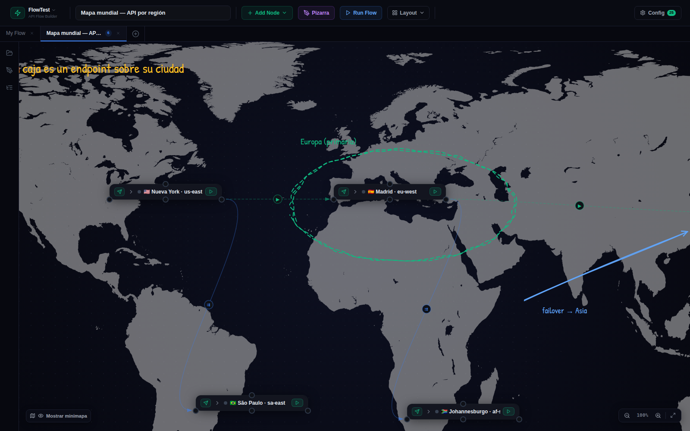

- **Subir imagen al proyecto** la guarda en `flows/assets/backgrounds/` (viaja con la carpeta del proyecto y se sirve como `/flow-assets/backgrounds/…`); también vale una URL http(s).
- La imagen se coloca en las **mismas coordenadas que los nodos** (X, Y y ancho en píxeles del lienzo; alto automático por proporción salvo que lo fijes) y **escala con el zoom**: lo que pongas sobre Madrid sigue sobre Madrid al acercar o alejar.
- Se ve también en el **minimapa** (4.50.0), en su posición y tamaño.
- **Opacidad** (10–100 %) para que las cajas se lean bien encima; **Quitar** la elimina.
- Se guarda **dentro del flow** (`settings.background`, ver [La configuración vive en cada flow](#la-configuración-vive-en-cada-flow--448)), cuenta para el tamaño del lienzo y sale en «Exportar PDF».
- MCP: `flow_background` (`set` con `imageSrc`/`x`/`y`/`width`/`height`/`opacity`, o `clear`); `flow_state` la devuelve en `settings.background`.

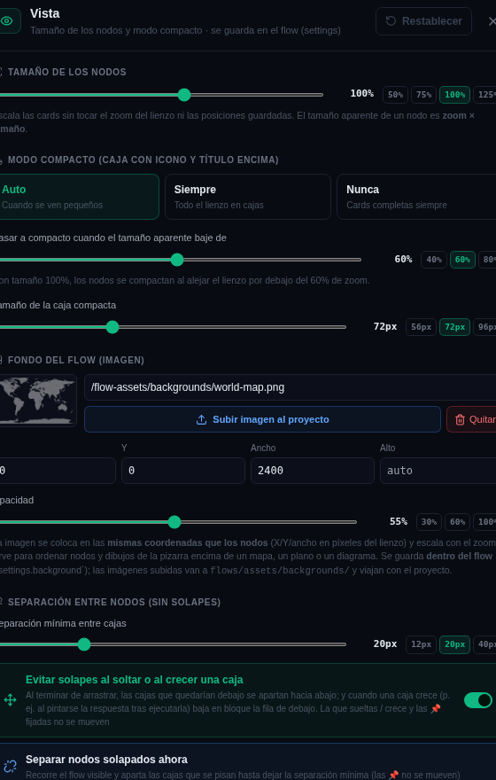

Ejemplo incluido: `mapa-mundial.flow.json` (un endpoint colapsado sobre cada región, con anotaciones de pizarra).

## La configuración vive en cada flow 🆕 (4.48)

Hasta la 4.47, **Config ▸ Vista**, **Ocultar conectores** y el estilo de la pizarra eran ajustes del navegador: los mismos para todas las pestañas y perdidos al cambiar de ordenador. Desde la 4.48 **se guardan dentro del propio flow**, en el campo opcional `settings` del `.flow.json`, y **cambian al cambiar de pestaña**:

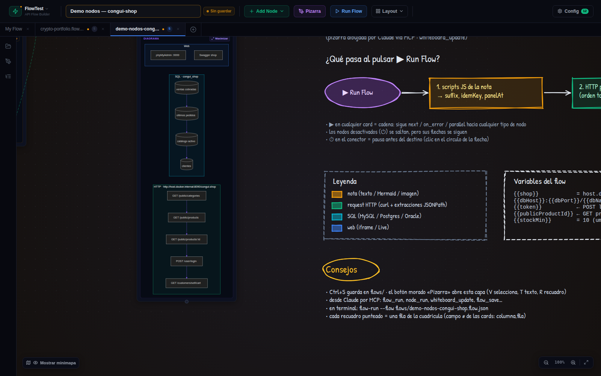

| Qué | Dónde se guarda |
|-----|-----------------|
| Config ▸ Vista (tamaño de los nodos, modo compacto, umbral, tooltip, clic abre, separación mínima, evitar solapes) | `settings.view` |
| Layout ▸ Ocultar conectores | `settings.hideConnections` |
| Estilo activo de la pizarra (color, grosor, trazo, relleno, opacidad, boceto, fuente, tamaño) | `settings.whiteboardStyle` |
| Zoom y posición del lienzo | `settings.viewport` (`zoom`, `scrollLeft`, `scrollTop`) |

- Cada flow se abre **tal y como lo dejaste**: mismo zoom, misma zona del lienzo, misma vista — también si lo abres desde otro navegador u ordenador (el fichero es la única fuente).
- Cambiar el **zoom o desplazar el lienzo no marca la pestaña como modificada** (no verás el ● ámbar por eso); Vista, conectores y estilo de pizarra sí, como cualquier otro cambio del flow.
- Los flows antiguos (sin `settings`) usan el **último valor que hayas usado en el navegador** como valor por defecto — y un flow nuevo hereda la vista que tenías en el anterior. En cuanto toques un ajuste en ese flow, se le queda grabado a él.
- En pantalla partida cada lado usa la configuración de su propio flow.
- El CLI ignora `settings`; el MCP lo devuelve en `flow_state` y lo escribe con `flow_overwrite` y `view_settings` (que ahora edita la vista del flow activo).

## Vista — tamaño de los nodos, modo compacto y separación 🆕 (4.27)

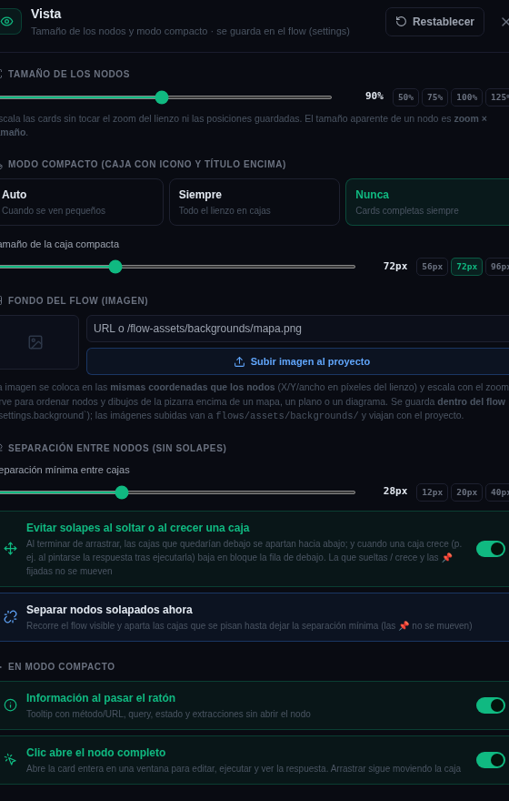

**Config ▸ Vista** abre un modal (como la Consola) con ajustes **solo de presentación** — desde 4.48 se guardan **dentro del flow** (`settings.view`, ver arriba); antes solo en el navegador:

| Ajuste | Qué hace |
|--------|----------|
| **Tamaño de los nodos** (30–150 %) | Escala las cards sin tocar el zoom del lienzo ni las posiciones guardadas. El tamaño aparente de un nodo es `zoom × tamaño` |
| **Modo compacto** Auto / Siempre / Nunca | En **Auto**, cuando el tamaño aparente baja del umbral (60 % por defecto) cada nodo se convierte en una **caja con el icono de su tipo** (y su método HTTP, motor SQL o tipo de nota), el **título encima con la redondita de estado**, sus 4 conectores y un **▶** debajo para ejecutarlo. **Siempre** compacta todo el lienzo; **Nunca** deja siempre las cards completas. Tamaño de la caja 48–120 px |
| **Información al pasar el ratón** | Tooltip con método y URL, query, conexión, estado, respuesta, extracciones o scripts — sin abrir el nodo |
| **Clic abre el nodo completo** | Un clic en la caja abre la card entera en una ventana (editar, ejecutar, ver la respuesta; Esc cierra). Arrastrar sigue moviendo la caja |
| **Separación mínima entre cajas** (0–80 px) | Distancia que se respeta al resolver solapes (también al expandir una caja colapsada) |
| **Evitar solapes al soltar o al crecer una caja** | Al terminar de arrastrar, las cajas que quedarían debajo se apartan hacia abajo; desde 4.35.0 también cuando una caja **crece** (p. ej. al pintarse la respuesta tras ejecutarla): baja **en bloque** la fila de debajo y todo lo que hay bajo ella, así la fila sigue alineada y la información se ve entera; **la que sueltas y las 📌 fijadas no se mueven** |
| **Separar nodos solapados ahora** | Recorre el flow visible (los dos, en split) y aparta las cajas que se pisan hasta dejar la separación mínima; el botón indica cuántas movió |


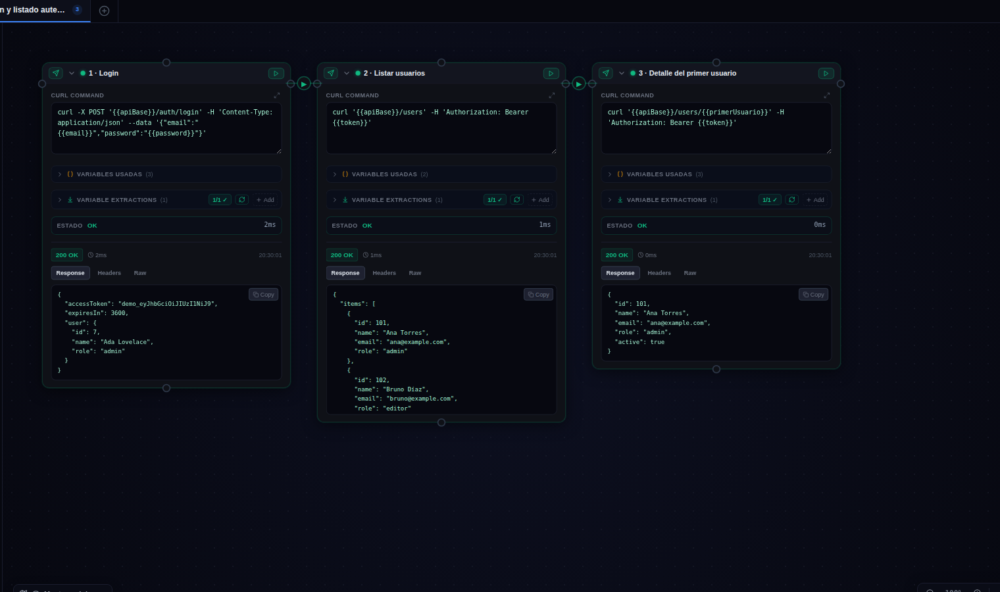

**Las filas bajan cuando una card crece 🆕 (4.35).** Al ejecutar una request o un SQL la caja se hace más alta al pintarse la respuesta; antes quedaba tapada por la fila siguiente. Ahora, con «Evitar solapes…» activo, las cajas que empiezan en esa fila **y todas las de debajo** bajan en bloque lo justo (separación mínima incluida), así la fila sigue alineada y se ve toda la información. La caja que creció y las 📌 fijadas no se mueven; al encoger (Reset, colapsar) nada vuelve a subir — Auto Layout o Alinear en cuadrícula recompactan.

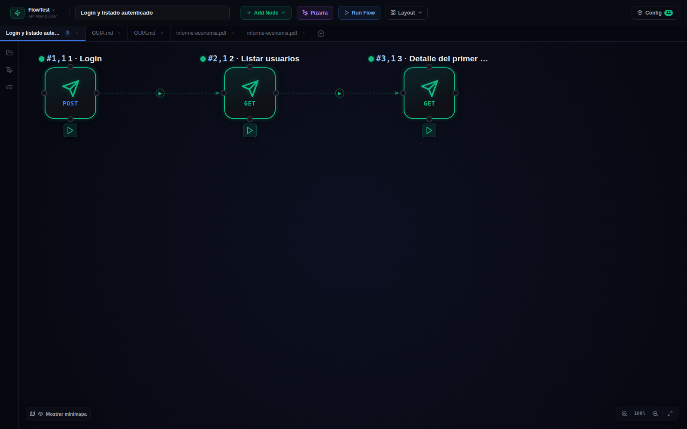

En compacto las líneas, el minimapa y la guía de nodos siguen la caja real; los relayouts del menú Layout (alinear, auto-layout, colapsar/expandir) funcionan igual.

## Proyecto — `flows/` como workspace 🆕 (4.25)

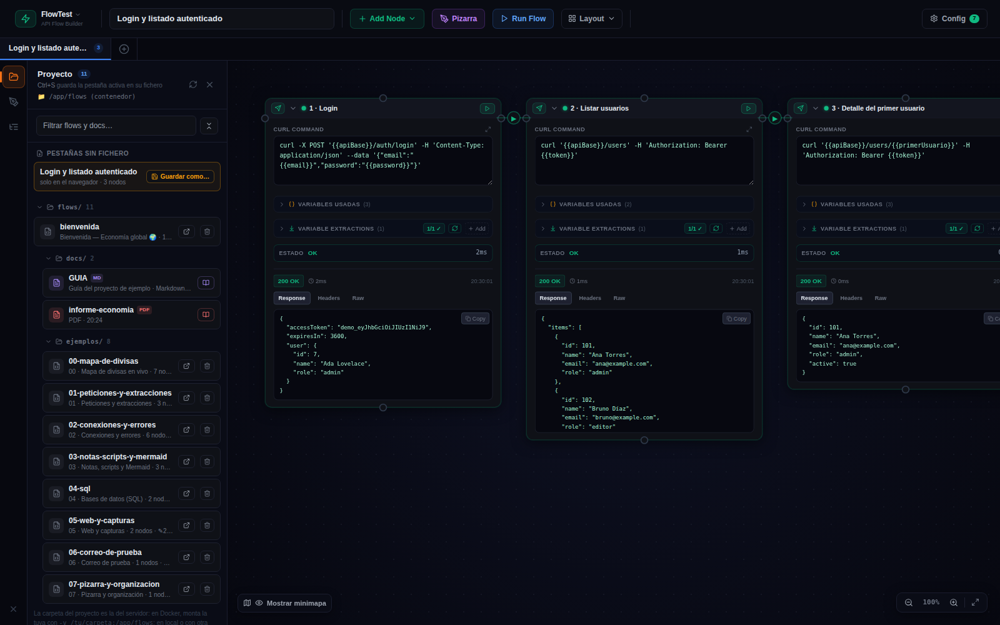

La carpeta `flows/` del servidor es el **proyecto** — en Docker `/app/flows`, así que **apúntala a una carpeta tuya** con `-v /tu/carpeta:/app/flows` (o monta donde quieras y fija `FLOW_FLOWS_DIR=/esa/ruta`; en local, `FLOW_FLOWS_DIR=/tu/carpeta npm run dev`). El panel muestra la ruta efectiva en su cabecera. El primer icono de la barra lateral abre el panel **Proyecto**:

| Zona | Qué hay |
|------|---------|
| **Pestañas sin fichero** | Pestañas creadas con *Nuevo* o importadas con *Abrir* que aún no viven en `flows/` — botón **Guardar como…** |
| **flows/** (y subcarpetas) | Cada `.flow.json` con su nombre de flow, nº de nodos y fecha. Desde la 4.41 las carpetas se muestran como **árbol anidado**: cada subcarpeta dentro de su padre, con su nombre corto e indentación (nada de rutas repetidas `flows/a/b/`). Se **pliegan** con un clic en su cabecera — plegar oculta todo el subárbol, el contador suma los ficheros del subárbol y se recuerda; botón plegar/desplegar todo junto al filtro; plegada, muestra si tiene abiertos o cambios. Marcas: azul = pestaña activa, verde = abierto, **●** = cambios sin guardar, ⚠ = el fichero cambió en disco después de abrirlo (CLI, MCP, git…) |
| Botones por fichero | Abrir en una pestaña · ir a la pestaña si ya está abierto · **Guardar** (si tiene cambios) · **Recargar desde disco** (si cambió fuera) · **✕ Cerrar la pestaña** (si está abierto; confirma si tiene cambios) · **🗑 Borrar el fichero** del disco (con confirmación; cierra la pestaña si estaba abierto) |

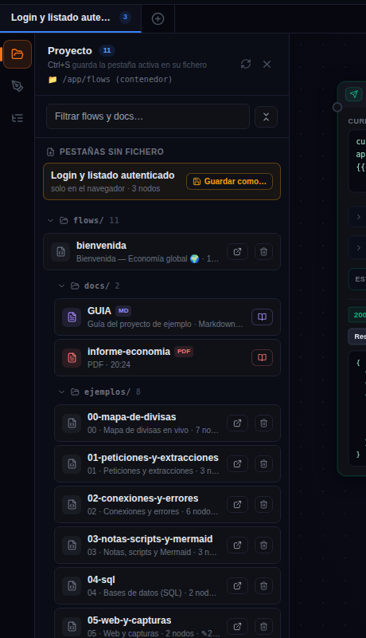

Cómo se trabaja:

- **Abrir**: clic en un fichero → pestaña con la etiqueta del fichero. Los ids de los nodos se conservan, así que al guardar el fichero cambia solo lo que tocaste (diffs limpios en git).
- **Guardar**: **Ctrl+S** (o **⚡ FlowTest ▸ Guardar**) escribe la pestaña activa en su fichero. El aviso «Sin guardar» y el ● ámbar desaparecen.
- **Guardar como…** (**Ctrl+Shift+S** o **⚡ FlowTest ▸ Guardar como…**): nombre + carpeta dentro de `flows/` (avisa si va a sobrescribir). Es lo que pide Ctrl+S en una pestaña sin fichero.
- **Conflictos**: si el fichero cambió en disco desde que lo abriste, Ctrl+S pregunta antes de pisarlo; el panel ofrece **recargar desde disco** (pierdes los cambios de la pestaña).
- **Docker**: los ficheros que crea o sobrescribe el contenedor conservan el **dueño del host** (aunque el server corra como root), así que puedes seguir editándolos y versionándolos sin `sudo`.

> Los flows editados en la web siguen autoguardándose en el navegador como siempre; lo nuevo es que además cada pestaña sabe a qué fichero pertenece. *Export* sigue sirviendo para descargar el `.flow.json` fuera del proyecto, y las tools MCP `flow_save` / `flow_file_read` escriben y leen la misma carpeta.

### Documentos Markdown en el panel 🆕 (4.38)

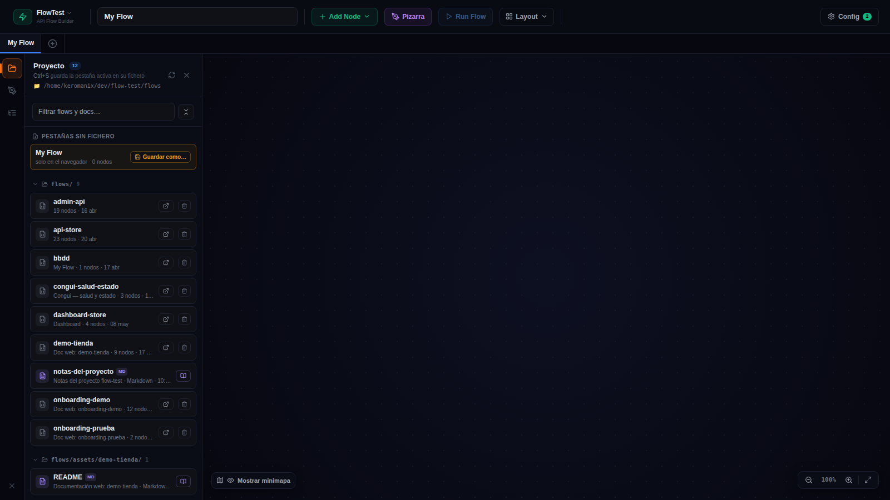

El panel lista también los **`.md`** de `flows/` (recursivo): tus notas y los informes que genera [flow-explore](07-flow-explore.md) en `assets/<slug>/README.md`. Cada uno aparece con su primer encabezado `# …` como título y un chip **MD**; el clic lo abre como **una pestaña más** (desde la 4.40 — antes era un modal): el documento ocupa el área del canvas, la pestaña lleva su chip **MD** y convive con las de flows; la fila del panel sabe si está abierto (ir a la pestaña / cerrar):

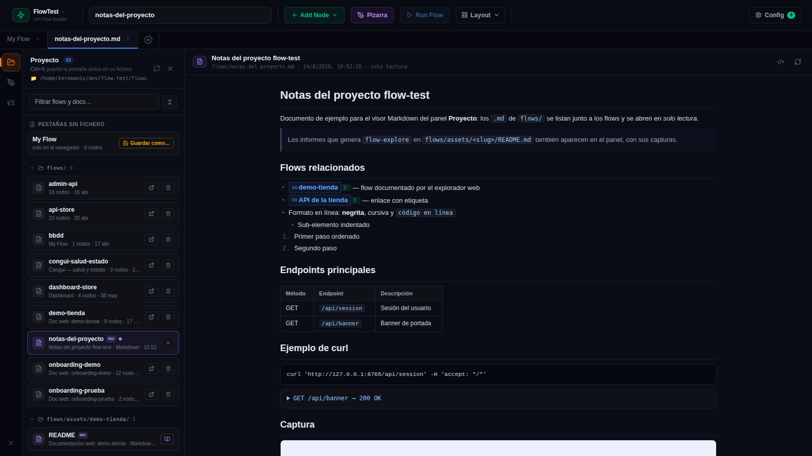

- Renderiza encabezados, listas, tablas, bloques de código, citas, desplegables `<details>` (los usan los informes del explorador) e imágenes — 🆕 5.14.2: **cualquier imagen del proyecto** se ve, con rutas relativas al documento (``) o desde la raíz de `flows/`; el servidor las sirve por `GET /workspace/image?path=` sin salir de `flows/` (misma guarda que el resto del workspace, carpetas privadas respetadas, 25 MB por imagen). Las de `flows/assets/` siguen por `/flow-assets/*`.
- Los **enlaces `[[flow]]`, `[[flow|texto]]` y `[[flow#Nombre de nodo]]`** funcionan como en las notas: cierran el visor, abren ese flow del proyecto y centran el nodo. Las URLs se abren en pestaña nueva.
- **▶ Ejecutar desde el documento** 🆕 (4.39): cada enlace `[[flow]]` lleva adosado un botón verde **▶** que abre el flow **y lanza su Run Flow completo** (scripts de notas + nodos HTTP y SQL en orden topológico) — un `.md` con enlaces sirve de lanzador de baterías de prueba. En `[[flow#Nodo]]` el ▶ ejecuta el flow entero.

  
- Botones: **ver la fuente** (el Markdown original) y **recargar desde disco**; la pestaña se cierra como cualquier otra.
- **Solo lectura**: los `.md` se editan fuera (tu editor, git); la web no los guarda ni los borra. El MCP (`flow_files_list`) y la CLI siguen viendo únicamente `.flow.json`.

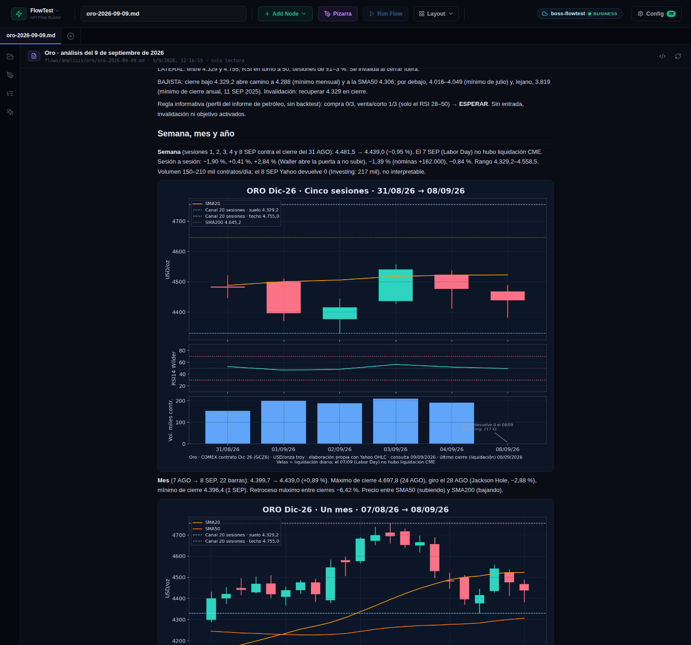
*Un informe del proyecto con sus gráficos, tal cual en el visor (5.14.2).*

### Documentos PDF en el panel 🆕 (4.45)

El panel Proyecto lista también los **`.pdf`** de `flows/` (recursivo, chip **PDF** rosa) y clicarlos abre **una pestaña de documento** de solo lectura, igual que los `.md`:

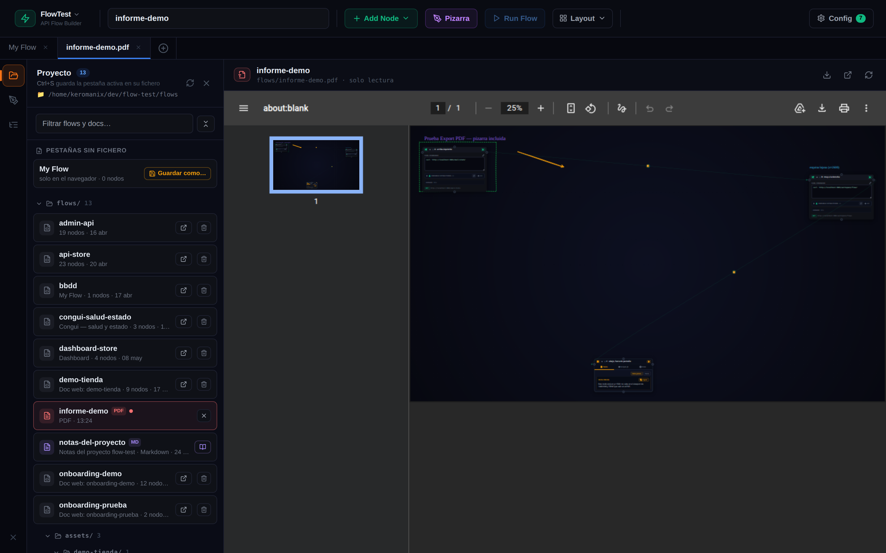

- El PDF lo pinta el **visor nativo del navegador** (zoom, buscar, imprimir); la cabecera añade **descargar**, **abrir en una pestaña del navegador** y **recargar desde disco**.
- Combina de maravilla con **Exportar PDF** (menú del logo, 4.44): el informe del canvas que exportes puede vivir en `flows/` y consultarse sin salir de la app.
- Solo lectura: Ctrl+S nunca lo pisa, y la pestaña jamás aparece como «sin guardar». Los enlaces `[[flow]]` de notas y documentos siguen resolviendo **solo contra flows** (los `.md`/`.pdf` quedan fuera).
- Servido por `GET /workspace/pdf?path=` con las mismas guardas que el resto del workspace (nada fuera de `flows/`, carpetas ocultas excluidas, máx. 50 MB).

## Enlaces entre flows en las notas 🆕 (4.25)

En el texto de una **nota** (Add Note), escribe:

| Sintaxis | Qué hace al hacer clic en la vista previa |
|----------|-------------------------------------------|
| `[[api-store]]` | Abre (o activa) el flow `api-store` — busca por nombre de fichero o de flow, primero en las pestañas y luego en `flows/` |
| `[[api-store|ver la API de la tienda]]` | Lo mismo, con texto propio |
| `[[api-store#Stripe - Webhook]]` | Abre el flow **y centra/resalta** el nodo con ese nombre |
| `https://…` | Las URLs se vuelven enlaces (nueva pestaña del navegador) |

Combinado con la pizarra y la guía de nodos, permite montar un flow «índice» que enlaza al resto del proyecto.

## Pizarra 🆕 (4.24)

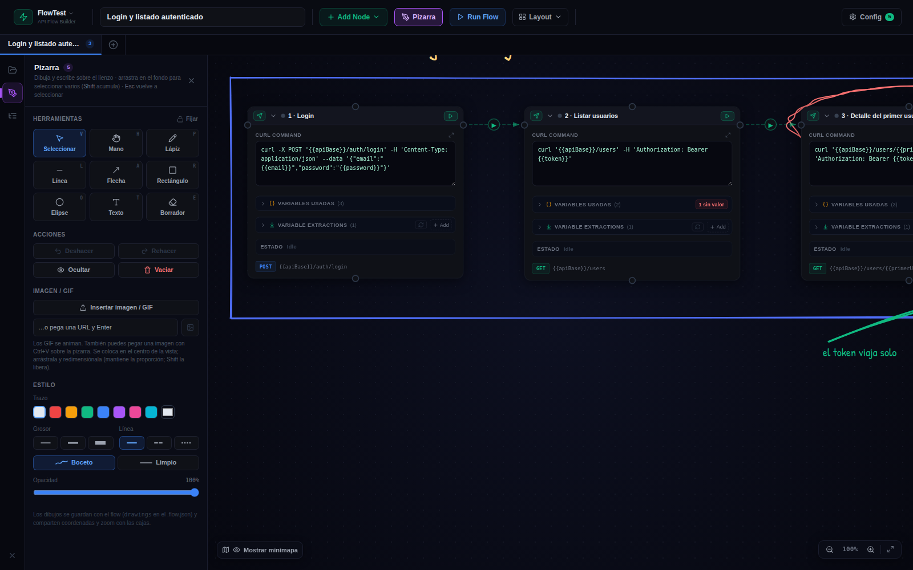

Una capa de dibujo libre **sobre el lienzo**, al estilo Excalidraw: rodea grupos de cajas, escribe títulos y avisos, dibuja tus propias flechas. Se abre con el botón morado **Pizarra** de la toolbar o desde la barra lateral.

| Sección del panel | Qué hay |
|-------------------|---------|
| **Herramientas** | Seleccionar (`V`), Mano (`H`, mueve el lienzo), Lápiz (`P`), Línea (`L`), Flecha (`A`), Rectángulo (`R`), Elipse (`O`), Texto (`T`), Borrador (`E`). El candado **Fijar** mantiene la herramienta tras dibujar (por defecto las formas vuelven a Seleccionar; el lápiz se queda) |
| **Acciones** | Deshacer / Rehacer (también `Ctrl+Z` / `Ctrl+Shift+Z`), Ocultar/Mostrar los dibujos, Vaciar la pizarra |
| **Selección** | Con algo seleccionado: Duplicar (`Ctrl+D`), Eliminar (`Supr`), Traer al frente, Enviar al fondo |
| **Estilo** | 8 colores + personalizado, grosor, línea continua/discontinua/punteada, trazo **Boceto** (a mano alzada) o **Limpio**, relleno para rectángulos y elipses, **fuente** (10 desde la 4.35, ver abajo) y tamaño para los textos, opacidad. Con una selección, el cambio se aplica a ella; si no, al siguiente dibujo |

Cómo se usa:

1. Elige una herramienta y **arrastra** sobre el lienzo. `Shift` restringe a cuadrado/círculo/ángulos de 45°.
2. **Texto**: clic donde quieras escribir, teclea (Enter hace salto de línea) y `Esc` o clic fuera para terminar. Doble clic sobre un texto existente lo edita.
3. **Seleccionar**: clic sobre un trazo (en formas sin relleno, sobre el borde) para moverlo o cambiarlo con los tiradores; `Shift` + clic suma a la selección.
4. **Selección múltiple** 🆕 (4.46): con Seleccionar activo, **arrastra sobre el fondo del lienzo** y aparece un rectángulo azul punteado que selecciona todos los dibujos que toca; con `Shift` el rectángulo **acumula** sobre lo que ya tenías seleccionado (y `Ctrl+A` sigue seleccionando todo). Duplicar, Eliminar, el estilo o traer al frente/enviar al fondo se aplican a todos a la vez. Un clic en el fondo, fuera de la selección, deselecciona. Las cajas del flow no se ven afectadas: el rectángulo solo existe mientras el panel Pizarra está abierto, y las cajas y conexiones siguen por encima y funcionan igual.
5. **Mover el grupo** 🆕 (4.47): arrastra desde cualquier trazo de la selección **o desde el hueco dentro de su caja** (p. ej. entre las piernas de un muñeco) — antes ese hueco empezaba un rectángulo nuevo y se perdía la selección. `Shift`+arrastre sobre el fondo sigue haciendo rectángulo aunque caiga dentro.
6. **Copiar y pegar** 🆕 (4.47): `Ctrl+C` copia la selección, `Ctrl+X` la corta y `Ctrl+V` la pega desplazada 24 px (cada pegado se desplaza un poco más); también con los botones **Copiar** / **Pegar** de la sección Selección del panel. Es un portapapeles propio de la pizarra (no toca el del sistema) y sobrevive al cambio de pestaña, así que sirve para llevar dibujos de un flow a otro dentro de la misma ventana. `Ctrl+D` sigue duplicando en el sitio.
7. `Esc` vuelve a Seleccionar y quita la selección.

Los dibujos comparten coordenadas y zoom con las cajas, se ven en el minimapa y **se guardan con el flow** (campo `drawings` del `.flow.json`, solo presente si hay dibujos). Viajan con export/import, GitHub Flows y MCP; el CLI los ignora. Con el panel cerrado, o en modo Seleccionar, las cajas funcionan exactamente igual que siempre (los dibujos quedan debajo de ellas).

> Ejemplo listo: [`examples/pizarra-anotada.flow.json`](../../examples/pizarra-anotada.flow.json).

### Imágenes y GIF en la pizarra 🆕 (4.50)

La pizarra admite **imágenes (PNG/JPG) y GIF animados** como un dibujo más:

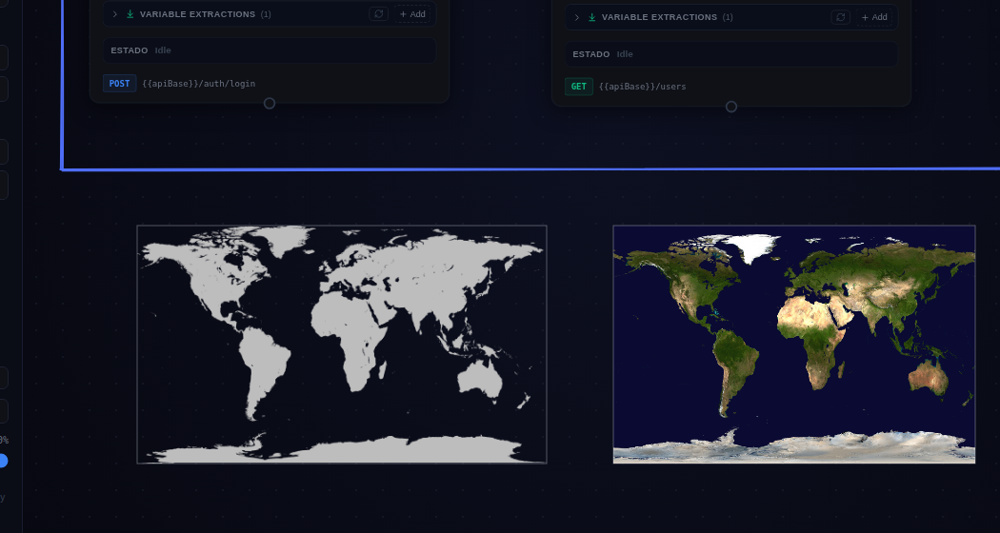

- **Panel Pizarra ▸ Imagen / GIF**: «Insertar imagen / GIF» abre un selector de fichero (la imagen se guarda en `flows/assets/whiteboard/` y viaja con el proyecto), o pega una URL y pulsa Enter.
- **Ctrl+V** con una imagen en el portapapeles (una captura de pantalla, una imagen copiada de la web) la inserta directamente — con el panel abierto y tras haber hecho clic en la pizarra.
- Se coloca en el centro de la vista (máx. 480 px de ancho, proporción natural) y queda seleccionada: arrástrala, redimensiónala (mantiene la proporción; **Shift** la libera), duplícala, cópiala/pégala, tráela al frente o envíala al fondo, cambia su opacidad desde el estilo de la selección. Los GIF se animan en el lienzo.
- Se guardan en el `.flow.json` como `drawings` de tipo `image` (`imageSrc`); el MCP las añade con `whiteboard_update` (`type: "image"`, `imageSrc`; ancho/alto medidos si no se indican).

### Variables vivas en la pizarra 🆕 (4.51)

Los **textos** de la pizarra (y la URL de las **imágenes**) resuelven `{{variables}}` al pintarse: escribe «Brent: {{brent}} $ {{semaforoBrent}}» junto a un nodo y el rótulo cambia con cada Run Flow. Si la variable no existe se ve el marcador tal cual. Al editar el texto se trabaja con el original (con los marcadores), y una imagen cuya URL lleve una variable (`/flow-assets/whiteboard/semaforo-{{estado}}.gif`) cambia de imagen según el estado. Combinado con los scripts «después» ([04](04-notas-mermaid-capturas.md#scripts-antes-y-después-con-vars--451)) convierte la pizarra en un panel de estado.

### Fuentes del texto 🆕 (4.35)

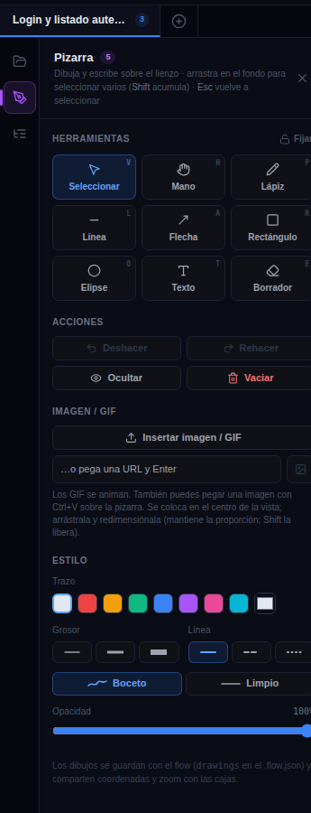

Con la herramienta **Texto** (o un texto seleccionado) el panel muestra una cuadrícula de **10 fuentes**, cada botón pintado con la suya y una **vista previa** con la fuente, tamaño y color actuales. Las ocho manuscritas van **empaquetadas con la aplicación** (no dependen de la red ni de las fuentes del sistema, también dentro de Docker):

| Botón | Fuente | Para qué |
|-------|--------|----------|
| **Manuscrita** (por defecto) | Patrick Hand | letra clara a mano, la de siempre (los flows antiguos la heredan) |
| **Boceto** | Caveat | cursiva rápida, tipo apunte |
| **Excalidraw** | Excalifont | la fuente real de Excalidraw |
| **Indie** | Indie Flower | trazo fino y letras redondas |
| **Rotulador** | Permanent Marker | títulos gruesos, como rotulador de pizarra |
| **Esbozo** | Cabin Sketch | letras «a lápiz» con tramado |
| **Arquitecto** | Architects Daughter | letra técnica de plano |
| **Nota** | Gloria Hallelujah | nota adhesiva |
| **Normal** / **Código** | sistema / monoespaciada | texto limpio y fragmentos de código |

En el `.flow.json` el campo `font` del texto vale `hand`, `sketch`, `excali`, `indie`, `marker`, `draft`, `architect`, `note`, `sans` o `mono` ([formato](../flows-formato.md)); el MCP `whiteboard_update` acepta los mismos valores y, si no se indica `w`/`h`, mide el texto con su fuente para que se pueda seleccionar y mover.

## Guía de nodos 🆕 (4.24)

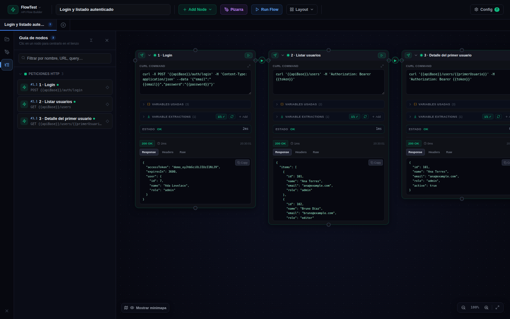

**Layout ▸ Guía de nodos** (o el icono de lista de la barra lateral) abre un índice de **todas las cajas del flow** agrupadas por tipo — Peticiones HTTP (método + URL), Consultas SQL (motor + query), Notas (texto / Mermaid / Captura) y Web (URL) — con su punto de estado, nº de orden y 📌. Tiene filtro de texto por nombre, URL o query. **Clic en un nodo → el lienzo se centra en él y la caja se resalta** un par de segundos. Imprescindible en flows de 20+ cajas.

Desde la 4.29 los **grupos se pliegan**: clic en la cabecera del grupo lo pliega/despliega (plegado muestra el recuento y los nombres en una línea); **Alt+clic, Shift+clic o doble clic** deja **solo ese grupo** abierto; el botón junto a la ✕ pliega/despliega todos. Se recuerda entre sesiones.

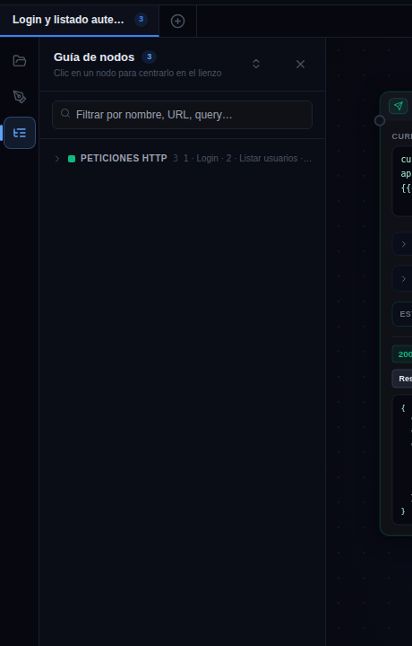

## Ocultar conectores 🆕 (4.24)

**Layout ▸ Ocultar conectores** quita las líneas de conexión del lienzo para una vista limpia (o para dibujar tus propias flechas en la pizarra). Las conexiones siguen existiendo y la línea provisional al conectar dos cajas se sigue viendo; el mismo item pasa a **Mostrar conectores** para volver. Es un ajuste de vista: no se guarda en el flow ni afecta a la ejecución.

## Variables usadas en la caja (4.23)

Cada caja **request** y **SQL** tiene una franja plegable **VARIABLES USADAS** que lista las `{{variables}}` de su curl, query o conexión con su valor actual, **editable in situ**: lo que escribes va a las variables de entorno del flow (y pisa el valor runtime si lo había). La cabecera avisa de las que **no tienen valor** y oculta las que parecen secretos.

## 📌 Fijar posición (4.23)

Cada caja (request, SQL, nota, web) tiene un candado en su cabecera: fijada, **nada la mueve** — ni colapsar/expandir (resolución de solapes), ni Collapse/Expand All, ni alinear, ni el auto-layout, ni el arrastre. Se guarda en el `.flow.json` (`pinned`).

## Historial

Cada **Run Flow** queda registrado: por nodo, la petición enviada (método, URL, headers, body) y la respuesta completa con duración. Es tu caja negra para «¿qué se envió exactamente hace 10 minutos?».

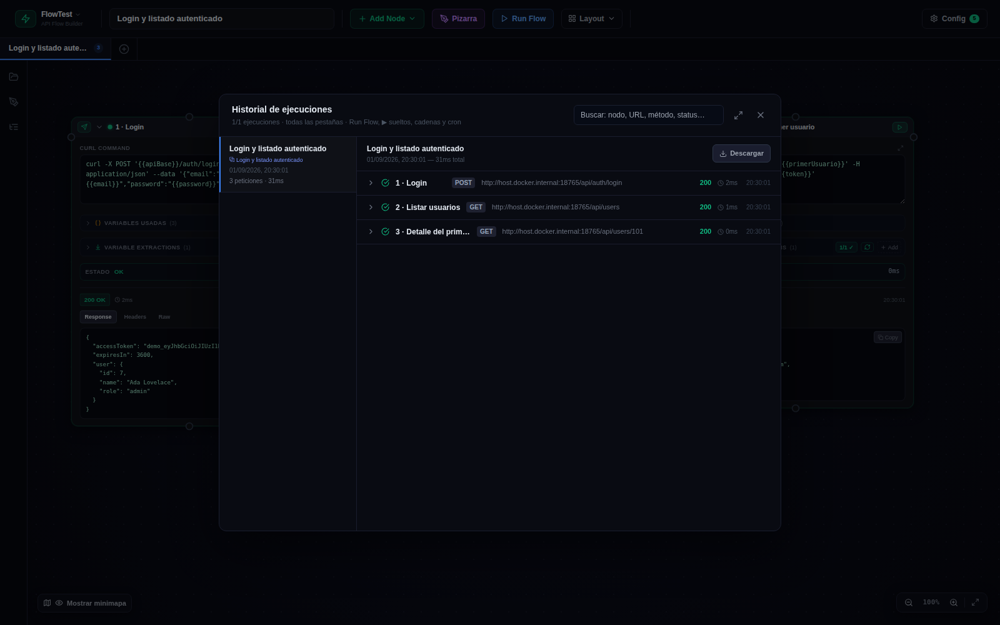

## Consola

El log de la propia aplicación: nodos añadidos, ejecuciones, capturas, errores de parseo, comandos del MCP… Con niveles (info/success/warn/error) y filtro. Si algo «no hace nada», aquí suele estar el porqué.

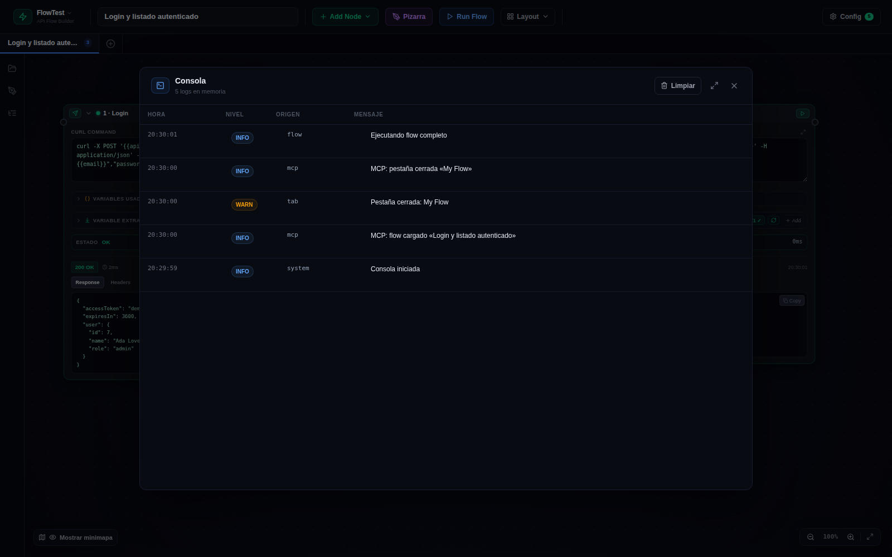

## Correo de prueba — SMTP embebido 🆕 (4.36)

**Config → Correo** abre un modal (como la Consola) con un **servidor de correo de mentira**: tus servicios le envían los correos de verdad (SMTP normal) y tú los ves aquí, sin crear cuentas reales ni que nada salga a Internet.

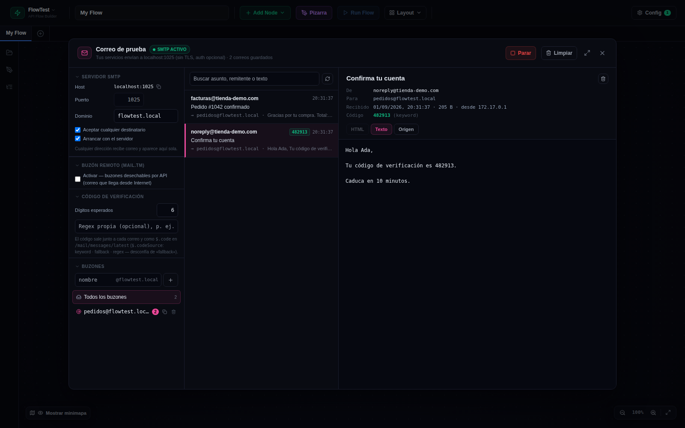

1. **Arrancar SMTP** (o marca «Arrancar con el servidor» para que arranque solo). Escucha en el puerto **1025** (`FLOW_MAIL_PORT`), sin TLS y con autenticación opcional: acepta cualquier usuario/contraseña.
2. **Buzones**: escribe `qa` y pulsa + → `qa@flowtest.local` (el dominio se edita en el panel, p. ej. `midominiotest.com`). Con **«Aceptar cualquier destinatario»** (por defecto) ni hace falta crearlos: toda dirección que reciba correo aparece sola en la lista con su contador. Si lo desmarcas, solo se aceptan los buzones creados y los del dominio; el resto recibe un `550`.
3. **Configura tu servicio**: host = la máquina del flow-test, puerto `1025`, sin TLS (si tu librería insiste en STARTTLS, desactívalo: `ignoreTLS`/`secure:false` en nodemailer, `MAIL_ENCRYPTION=null` en Laravel, `EMAIL_USE_TLS=False` en Django…). En Docker publica el puerto: `-p 1025:1025` (o `flow:1025` desde otro contenedor de la misma red).
4. **Leer**: la lista se refresca sola cada 2 s; clic en un correo → remitente, destinatarios, fecha, tamaño, adjuntos (nombre/tipo/tamaño) y pestañas **HTML** (renderizado en un iframe aislado), **Texto** y **Origen** (el mensaje tal cual llegó). Búsqueda por asunto/remitente/texto, filtro por buzón, **Vaciar buzón** / **Limpiar**, borrar uno, borrar un buzón con sus correos.

Los correos se guardan en `flows/.mail/` (carpeta oculta: no sale en Proyecto ni en git; hasta 500, los más antiguos se descartan) y sobreviven al reinicio.

**Comprobarlo desde un flow.** El botón «Comprobar desde un flow» de cada buzón copia un `curl` listo para un nodo HTTP:

```bash
curl 'http://localhost:9998/mail/messages/latest?to=qa@flowtest.local&subject=Confirma'
# → { from, to, subject, text, html, attachments[], receivedAt, … } · 404 si no ha llegado nada
```

Así el flow «registro → el backend envía el correo → ¿llegó? → extraer `$.text` y sacar el código OTP o el enlace de confirmación → siguiente petición» se verifica de punta a punta. **Por MCP** (4.37): `mail_server start` → `mail_address add` → acción bajo prueba → `mail_messages latest {to, subject}` — la IA lo hace sola, sin pestaña web ([10 MCP](10-mcp.md)). Filtros: `to`, `from`, `subject`, `since` (ms), `q`; `GET /mail/messages` lista, `DELETE /mail/messages?to=` vacía un buzón.

### Extracción del código y buzones de Internet — mail.tm 🆕 (4.42)

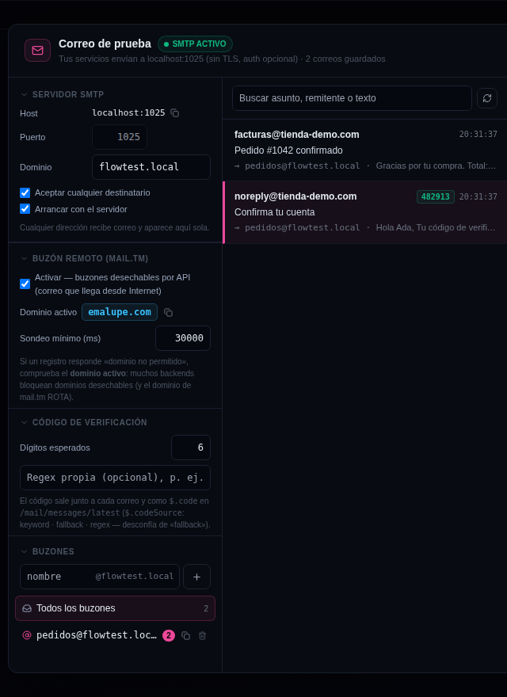

**El código, extraído.** Cada correo sale con `code` y `codeSource` en `GET /mail/messages`, `GET /mail/messages/latest` y en el panel (badge verde junto al asunto):

- `keyword` — palabra clave (`código`, `code`, `otp`, `verificación`, `clave`, `pin`) + hasta 60 caracteres no numéricos + N dígitos. La vía fiable.
- `fallback` — primer grupo **aislado** de N dígitos si no hay palabra clave. Puede pescar basura (un año, un importe): desconfía.
- `regex` — si configuras una **regex propia** (manda el primer grupo de captura), útil para OTPs **alfanuméricos**, p. ej. `firma[^A-Z0-9]{0,40}([A-Z0-9]{6})`.

Se busca sobre el **texto plano** (si el correo solo trae HTML se deriva de él: un `<td width="600">` o un color hex no se cuelan). La longitud (6 por defecto) y la regex se configuran en el panel. Con esto, «registro → leer código → validar» son **3 nodos HTTP sin scripts**: el segundo hace `GET /mail/messages/latest?to=buzón` y extrae `$.code`.

**Buzones de Internet (mail.tm).** El SMTP del 1025 solo sirve si el emisor puede abrir un TCP hasta tu máquina; cuando el correo lo envía un servicio en la nube, activa **Config → Correo ▸ Buzón remoto (mail.tm)** — conviven los dos, con **una sola lista** de correos (etiqueta `tm` en los remotos):

- **Dominio activo** bien visible — ¡rota!, y muchos backends bloquean listas de dominios desechables: si el registro responde «dominio no permitido», esto es lo primero que comprobar.
- **Crear buzón**: escribe el nombre y conmuta el sufijo `@…` al dominio de mail.tm — crea la cuenta real, guarda credenciales y token en `flows/.mail/config.json` (sobreviven al reinicio, sin variables de entorno) y **renueva el token** cuando caduca.
- **Auto-creación**: si un flow pregunta `latest?to=algo@<dominio-activo>` y el buzón no existe, se crea solo (el equivalente al «Aceptar cualquier destinatario» del SMTP). Mientras no llegue nada, `latest` sigue devolviendo **404** — dale margen con la pausa (`delayMs`) del conector.
- **Sondeo con cabeza**: mail.tm tiene rate limit — solo se consulta al pedir `/mail/*` (panel abierto o un flow preguntando) y como mucho una vez por intervalo (5 s por defecto, configurable). Panel cerrado y sin flows = **cero peticiones**.
- Borrar el buzón **borra también la cuenta remota**.

Por MCP: `mail_server` acepta `mailtmEnabled`, `mailtmPollMs`, `codeLength`, `codeRegex`; `mail_address add` acepta `provider: mailtm`; `mail_messages latest` devuelve `code`/`codeSource` ya extraídos.

### Secciones plegables 🆕 (4.43)

La columna izquierda del panel ya son cuatro secciones **plegables** — clic en la cabecera (chevron) de **Servidor SMTP**, **Buzón remoto (mail.tm)**, **Código de verificación** o **Buzones**:

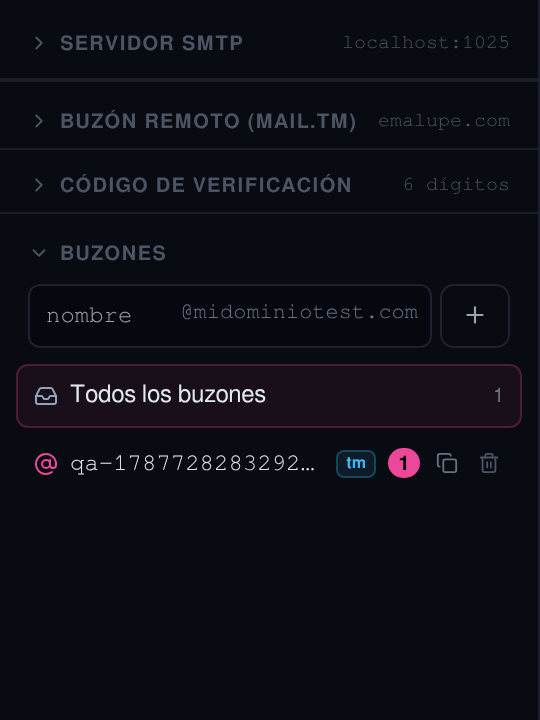

- Plegada, cada cabecera resume lo importante: el host del SMTP (o «parado»), el **dominio activo** de mail.tm (u «off»), los dígitos esperados del código (o «regex») y el número de buzones.
- Plegar **Buzones** oculta solo el alta de buzón nuevo; la lista de buzones sigue visible.
- El estado se recuerda entre sesiones (localStorage): configura una vez, pliega, y el panel queda para lo que se usa a diario — buzones y correos.

### ¿Y si el servicio que envía corre en otra máquina?

Llega igual: el SMTP escucha en todas las interfaces (`0.0.0.0:1025`); solo hace falta que esa máquina pueda abrir una conexión TCP al puerto 1025 de la que corre flow-app.

| Dónde está el servicio | Host SMTP a configurar | Qué tener en cuenta |
|---|---|---|
| Misma LAN / VPN | IP de tu máquina (`192.168.x.x`), puerto `1025` | Publica el puerto en Docker (`-p 1025:1025`) y ábrelo en tu firewall (`sudo ufw allow 1025/tcp`) |
| Otro contenedor de la misma red Docker | `flow:1025` (nombre del contenedor) | No pasa por el host ni necesita `-p` |
| Servidor en la nube / otra red sin ruta hacia ti | `localhost:1025` **en el servidor** + túnel inverso desde tu máquina: `ssh -R 1025:localhost:1025 usuario@servidor` | O `ngrok tcp 1025` / Cloudflare Tunnel y usas el host:puerto que te den |
| Flow-app desplegado en un servidor | `<servidor>:1025` | Publica el 1025 y ábrelo en el firewall / security group **solo a las IPs de tus servicios**: es un buzón abierto sin auth real |

Prueba de conectividad desde la otra máquina antes de tocar el servicio: `nc -zv <host> 1025` — si responde `220 flow-test mail sandbox`, ya está. El puerto es `1025` y no `25` a propósito (el 25 lo bloquean muchos proveedores y requiere root); cámbialo en el panel, por MCP o con `FLOW_MAIL_PORT`.

## Batch Run

Ejecuta **varios flows en lote** (los seleccionas de tus pestañas o de archivos) y muestra el resultado de cada uno. La versión CI de esto es `flow-run --dir` ([09 El CLI flow-run](09-cli-flow-run.md)).

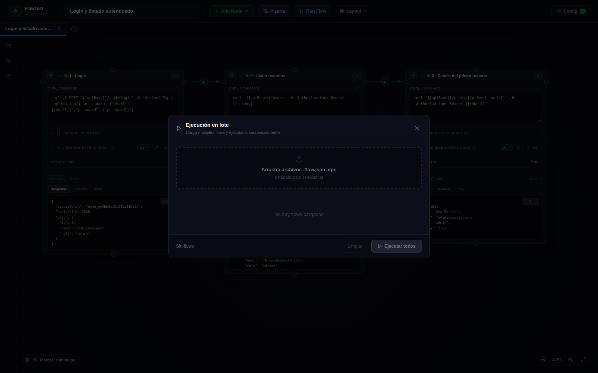

## GitHub Flows

Conecta con un repo de GitHub (token + owner/repo/rama/carpeta) para **guardar y cargar flows directamente del repo** — el equipo comparte flows sin pasarse archivos.

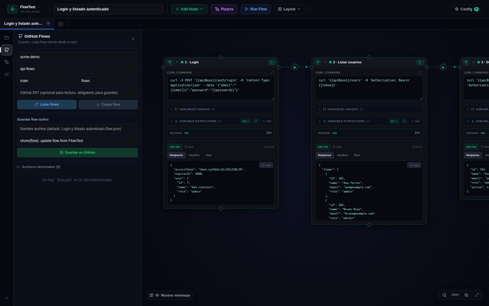

## Export / Abrir / guardado

- Todo se **autoguarda en localStorage** del navegador al momento: cierra y abre tranquilo.
- **Export** descarga el `.flow.json` del flow activo (estado limpio: sin respuestas ni contraseñas de runtime). Es el formato que consumen el CLI, el Batch, GitHub Flows y el MCP.
- **Abrir** (en la barra de pestañas) importa un `.flow.json` en una pestaña nueva.
- El indicador ámbar **«Sin guardar»** junto al nombre avisa de cambios no exportados (los dibujos de la pizarra también cuentan).

## Collapse All · Expand All · Auto Layout · Alinear

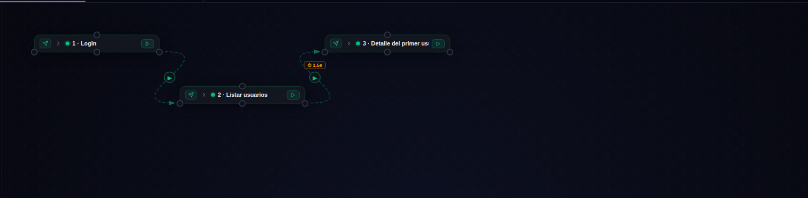

- **Reset**: limpia respuestas y estados (no borra nodos ni conexiones).
- **Collapse All**: colapsa todas las cajitas **y las acerca** — escala las distancias al ritmo al que encogen las cajas, **conservando tu disposición** (no reordena).
- **Expand All**: expande todo y **restaura las posiciones exactas** previas al Collapse All. Si expandes una cajita suelta, las de debajo se **empujan** para no pisarse.
- **Auto Layout**: reordena por el grafo — la cadena `next` en columnas, y los nodos colgados con conexión informativa (`none`) como satélites bajo su padre. Ordena **todos** los tipos de nodo.
- **Alinear en fila / en columna**: coloca los nodos según su **nº de orden** (campo `#` de cada cabecera; los que no tienen número van al final, en orden de lectura).
- Las cajas **📌 fijadas** no se mueven con ninguna de estas acciones.

## Cron

Los nodos Request, SQL, Web y Nota tienen pestaña **Cron**: ejecución periódica del nodo (cada X min/h) mientras la pestaña esté abierta. El badge con cuenta atrás aparece en la cabecera del nodo.

## Webhook entrante 🆕 (5.3)

Una URL secreta que **ejecuta el flow en el servidor** al recibir un POST — desde CI, otro
servicio o un cron externo, sin navegador.

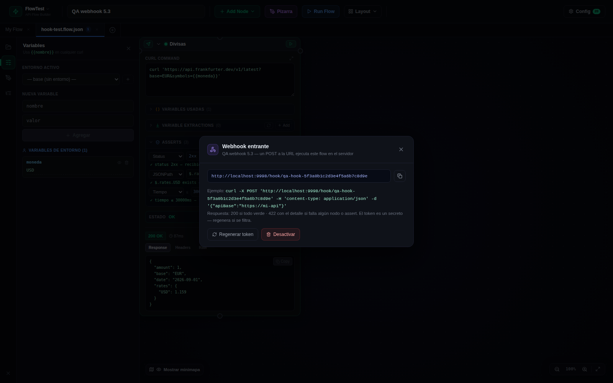

Menú del logo → **«Webhook entrante…»** → *Activar webhook* genera el token y te da la URL
(`POST /hook/<token>`). El webhook **se publica al guardar el flow** en `flows/` (Ctrl+S): el
servidor lo lee del disco.

- Los **query params** y las claves planas del **body JSON** llegan como `{{variables}}`
  (el body gana); `__env=prod` elige el entorno.
- Ejecuta con el runner del CLI: SQL, scripts de notas, **asserts** y entornos incluidos — y el
  mismo candado de plan (en trial responde 402).
- Respuesta: **200** si todo verde, **422** con el detalle por nodo (incluidos los asserts que
  fallaron), **404** si el token no existe. El token es una credencial: *Regenerar* si se filtra.

```bash
curl -X POST 'https://tu-flow/hook/abc123…' \
  -H 'content-type: application/json' -d '{"apiBase":"https://staging.mi-api"}'
```

## Monitor programado 🆕 (5.4)

En el mismo modal **«Automatización…»** del menú del logo, bajo el webhook: elige un intervalo
(5 min / 15 min / 1 h / 1 día, o el que tecleas) y el **servidor ejecuta el flow solo, sin
navegador abierto** — la diferencia clave con el cron por nodo. Guarda los últimos 100 runs en
`flows/.monitors/` (estado en vivo en el propio modal y en `GET /monitors`) y, si pones un
`notifyUrl`, hace POST con el resultado **al fallar o cambiar de estado** (o en cada run):
apunta a un webhook de Slack/Telegram/n8n… o al `/hook/` de otro flow para reaccionar en cadena.
Se publica al guardar el flow (Ctrl+S).

### Vigilancia: reglas y avisos 🆕 (5.17)

Un monitor sin reglas solo sabe decir «el flow falló». Con **reglas** vigila un **dato**: el servidor
ejecuta el flow cada N minutos, mira las variables con las que termina el run (las **extracciones** y
los **scripts «después»**) y te avisa **solo cuando algo cambia de estado** — no en cada ejecución.

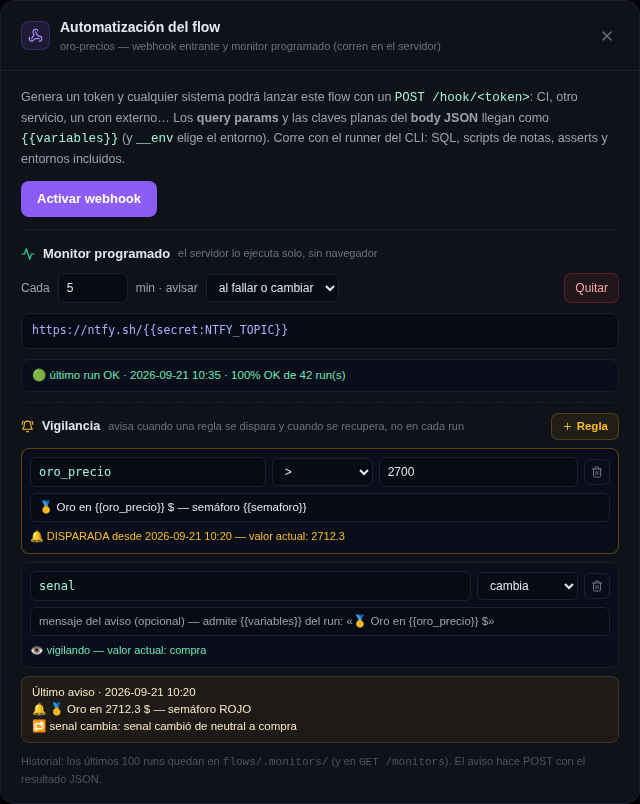

1. Extrae el dato a una variable (JSONPath en el Request, columna en el SQL) o calcúlalo en un script
   «después» de una nota (`return Number(vars.oro_precio) > Number(vars.resistencia) ? 'ROTURA' : 'RANGO'`).
2. **Automatización… ▸ Monitor programado ▸ + Regla**: variable (el campo sugiere las que produce el flow),
   operador y valor. Operadores: `>` `≥` `<` `≤` `=` `≠`, **contiene** / **no contiene** y **cambia**
   (avisa cuando el valor es distinto al de la ejecución anterior). Los números se entienden aunque
   vengan como `2.650,40` o `2650.4 USD`.
3. Opcional: un **mensaje** propio con `{{variables}}` del run — «🥇 Oro en {{oro_precio}} $».
4. Pon un `notifyUrl` y **guarda** (Ctrl+S): la vigilancia vive en el servidor.

**Cuándo avisa.** 🔔 cuando una regla **se dispara** (la condición pasa a cumplirse), ✅ cuando **se
recupera** (deja de cumplirse) y 🔁 cuando un valor vigilado con «cambia» es distinto. Un precio que
lleva tres horas por encima del nivel manda **un** aviso, no treinta y seis. Si en una ejecución el dato
no llega (la API falló), la regla **conserva su estado** y el aviso que recibes es el del fallo.

**Qué recibe el `notifyUrl`.** Un POST JSON con `text` y `message` (el mismo resumen legible, una línea
por alerta — lo que esperan Slack, Telegram, Mattermost, ntfy o n8n), `alerts`
(`kind: fired | recovered | changed`, `message`, `variable`, `value`), `rules` (estado de cada regla) y
el resultado del run. La URL admite **`{{secret:NOMBRE}}`** (Variables ▸ 🔒 Credenciales): el token de
tu bot no se guarda en el `.flow.json`.

```text
https://ntfy.sh/{{secret:NTFY_TOPIC}}
https://api.telegram.org/bot{{secret:TG_BOT}}/sendMessage?chat_id=123456
https://hooks.slack.com/services/{{secret:SLACK_HOOK}}
```

El modal enseña el estado de cada regla (🔔 **disparada desde…**, 🟢 en calma, 👁️ vigilando, ❔ sin
dato) y el **último aviso**. El historial solo guarda el valor de las variables vigiladas, nunca el
resto. Una IA puede montarlo todo con la tool MCP **`flow_monitor`** (y consultar `status` sin navegador).

## Colaboración en vivo 🆕 (5.5 · exclusiva Business)

Dos (o más) personas con **el mismo fichero de `flows/` abierto** se ven editar en tiempo real:

- **Presencia**: chip flotante **👥 N** (arriba a la derecha) con quién está conectado y en qué flow
  (verde pulsante si alguien comparte el tuyo); tu nombre es editable desde el propio chip y las filas
  del panel Proyecto muestran un punto de color por cada compañero que tenga ese fichero abierto.
- **Edición sincronizada por nodos**: mueves una caja, cambias un curl, dibujas en la pizarra… y el
  resto lo ve al instante, con una etiqueta «✏️ nombre» sobre el nodo tocado. Cada uno conserva SUS
  respuestas y ejecuciones (se comparte el documento, no el run).
- **Aviso de pisada**: si dos tocáis lo mismo a la vez, gana el último **y el que pierde se entera
  siempre** — toast «⚠️ X sobrescribió tu cambio en “nodo”» + línea en la Consola, con la salida a mano:
  **Ctrl+Z recupera tu versión** (y se la reenvía al resto).
- **Guardado coordinado**: cuando un compañero guarda (Ctrl+S), tu pestaña adopta el fichero y queda
  limpia — sin conflictos de «cambió en disco».

Disponible con **plan Business** (cloud) o licencia team/enterprise (self-hosted); sin él, la función
ni aparece. El fichero sigue mandando: la colaboración sincroniza canvases vivos, quien guarda escribe.

## Deshacer y rehacer del canvas 🆕 (5.5 · todos los planes)

**Ctrl+Z / Ctrl+Y** (o Ctrl+Shift+Z) deshacen y rehacen los cambios **estructurales** del flow activo:
mover/crear/borrar nodos, conexiones, pizarra, variables… (50 pasos por pestaña). Las respuestas y
resultados se conservan al deshacer. Dentro de un campo de texto sigue mandando el undo nativo, y si
tu último clic fue en la pizarra, el atajo deshace la pizarra (como siempre).

## Panel Proyecto compacto 🆕 (5.5)

Las filas de fichero son ahora **una sola línea estilo árbol** (icono + nombre + los mismos botones,
en fantasma): cabe más del doble de proyecto en pantalla. Los detalles (nº de nodos, dibujos, fecha)
viven en el tooltip; el JSON inválido se marca con un chip rojo `!JSON`. Y desde la 5.5.0 los
documentos `.md` del proyecto se abren **en cualquier plan** (el tour de la galería incluido).

## Carpetas privadas por miembro 🆕 (5.6 · cloud)

En una organización del cloud, cada miembro tiene su carpeta **`privado/<usuario>/` 🔒** dentro del
workspace compartido: solo su dueño la ve en el panel Proyecto y solo él puede abrir, guardar o
borrar lo que hay dentro (los demás reciben un 403 — ni siquiera aparece en sus listados). El resto
del árbol sigue siendo el espacio común del equipo de siempre. En self-hosted no aplica: sin
cuentas, tu máquina es toda tuya.

**Guardar con ámbito (5.7):** el modal «Guardar como…» (Ctrl+Shift+S) trae en el cloud un selector
**👥 Compartido / 🔒 Privado** — al elegir Privado el flow va a tu `privado/<usuario>/` sin teclear
la ruta — y muestra las carpetas existentes como **chips clicables** (filtradas por ámbito) en vez de
una caja de texto a ciegas. La ruta final y su aviso se actualizan en vivo.

**Límite de flows por plan (5.7):** Trial 3 · Pro 100 (+packs de 100) · **Business 1.000** (10× Pro).
Al llegar al tope, guardar un flow NUEVO devuelve un aviso (los existentes se siguen editando). Los
flows de fábrica (bienvenida y `ejemplos/`) no cuentan.
