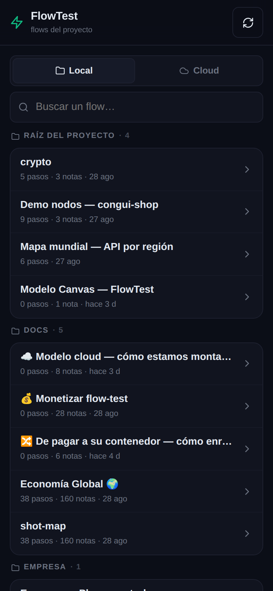
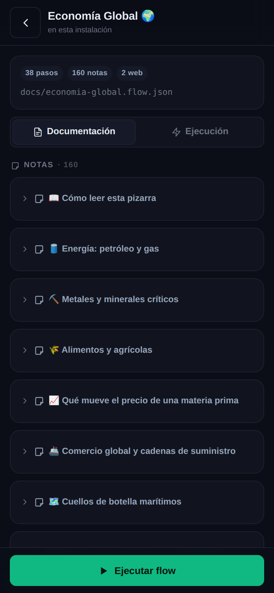
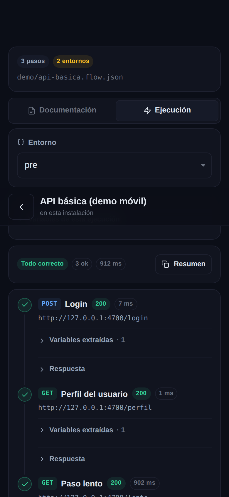
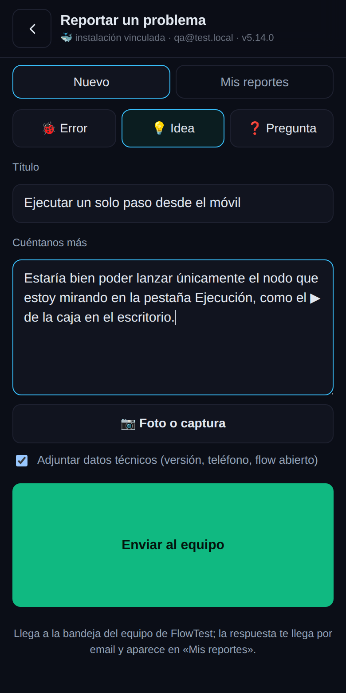

# 📱 12 · La vista móvil

Desde la **5.11**, FlowTest trae una segunda cara pensada para el teléfono: entra en
**`http://tu-servidor:9998/m`** y tienes tus flows para **ejecutarlos, ver el resultado y leerlos como
documentación**. Editar sigue siendo cosa del escritorio.

No es la aplicación de siempre encogida: es una **app aparte**. El editor (canvas, pizarra, arrastrar
cajas) no se descarga en el móvil, así que abre rápido incluso con datos.

> Si entras a `http://tu-servidor:9998` desde un teléfono, te lleva solo a `/m` **antes** de descargar
> el editor. Para ver el escritorio en un móvil o una tablet, usa `?desktop=1` (se recuerda) o el
> enlace «Abrir la versión de escritorio» del pie.

## Llegar desde el teléfono

El móvil tiene que poder ver la máquina donde corre FlowTest. En una red doméstica u oficina basta la
IP del servidor:

```bash
# en la máquina del contenedor
hostname -I | awk '{print $1}'   # p. ej. 192.168.1.50
# en el teléfono: http://192.168.1.50:9998/m
```

Añádela a la **pantalla de inicio** y se abre como una aplicación, sin barras del navegador.

## La lista



Los flows del proyecto, agrupados por carpeta y con buscador. Cada fila dice cuántos pasos tiene, si
lleva notas y cuándo se tocó por última vez.

Si tu instalación está **vinculada a una cuenta cloud**, arriba aparece el selector **💻 Local /
☁️ Cloud** y la lista arranca en el entorno que gobierna la instalación, igual que el panel Proyecto
del escritorio.

## Documentación de un flow



La pestaña **Documentación** enseña el flow como se lee, no como se dibuja:

- **Notas** con su texto, sus diagramas Mermaid o sus capturas. En un flow con muchas notas llegan
  plegadas y se abren al tocarlas.
- **Pasos en orden de ejecución**, numerados, con su método, su dirección y los asserts que tiene cada
  uno. Es el mismo orden en que los va a lanzar el runner.
- **Variables** y el entorno activo.

Sirve para consultar en una reunión qué comprueba un flujo, o para enseñárselo a alguien sin abrir el
portátil.

## Ejecutar y ver el resultado



La pestaña **Ejecución** lo lanza en el servidor, con el mismo motor que usan el CLI, los webhooks y
los monitores. Antes de ejecutar puedes:

- elegir **entorno** (dev, pre, pro… los que tenga el flow),
- **cambiar variables solo para esa ejecución**, sin tocar el fichero.

Mientras corre ves una **barra de progreso**, la **salida del runner en directo** y los pasos que ya
han terminado marcados en verde o en rojo. Al acabar, cada nodo muestra su código, el tiempo, los
asserts, las variables extraídas y el cuerpo de la respuesta (plegado, con botón de copiar). El botón
**Resumen** copia el resultado en texto para pegarlo donde haga falta.

Si te sales de la pantalla a mitad, la ejecución se corta en el servidor: no quedan procesos sueltos.

## Lo que no hace

- **No se edita.** Para tocar un flow, el escritorio.
- **Ejecutar requiere plan Pro**, igual que el CLI y los webhooks. Durante la prueba de 14 días la
  documentación se ve entera y el botón de ejecutar queda desactivado.
- Un flow que vive **en tu cloud** se puede leer, pero para ejecutarlo con el motor de esta
  instalación el botón te ofrece **traerlo** a su disco primero.
- Los documentos `.md` y `.pdf` del proyecto, y el borrado de ficheros, siguen siendo del escritorio.


## La pestaña ✨ IA 🆕 (5.13.1)

El detalle de un flow tiene una tercera pestaña, **✨ IA**: el mismo asistente del escritorio ([13](13-asistente-ia.md)) desde el teléfono. Con cada mensaje la IA recibe un resumen del flow que estás leyendo (pasos en orden de ejecución, variables, asserts), así puedes pedirle que te lo explique, que te diga qué mejorarías o que revise el último fallo. Sin el escritorio abierto **no edita nada** (no hay canvas): explica y propone. Si tienes el escritorio abierto en el mismo servidor, las herramientas actúan sobre esa pestaña y lo ves llegar allí, con las mismas confirmaciones (Sí/No) y el botón de parar. La clave, el proveedor y el modelo son los del servidor: se configuran en el escritorio (panel ✨ ▸ ⚙). Función Pro.

## Reportar un problema desde el móvil 🆕 (5.14)

El botón 💬 de la barra superior (en la lista y dentro de un flow) abre el mismo formulario que en el escritorio: tipo (error / idea / pregunta), título, descripción, **foto de la cámara o de la galería** y datos técnicos opcionales (versión, teléfono, flow abierto). La pestaña «Mis reportes» muestra el estado y la respuesta del equipo. Es una función Pro/Business; en la prueba el formulario se ve pero no envía. Detalles en [14](14-reportar-problemas.md).


