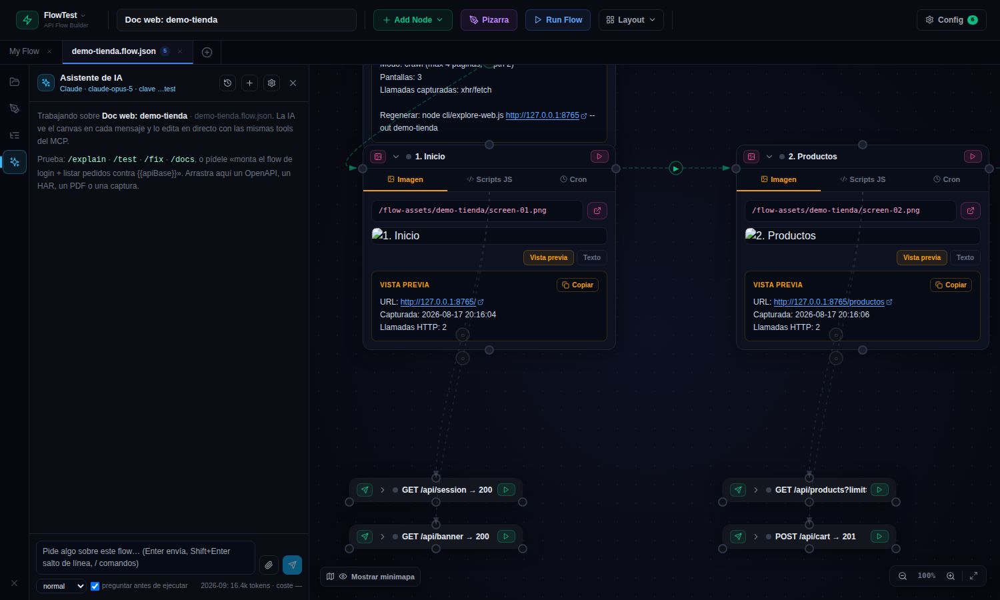
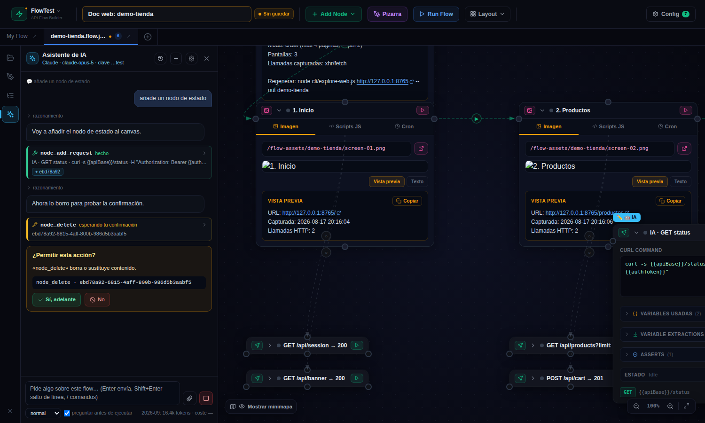
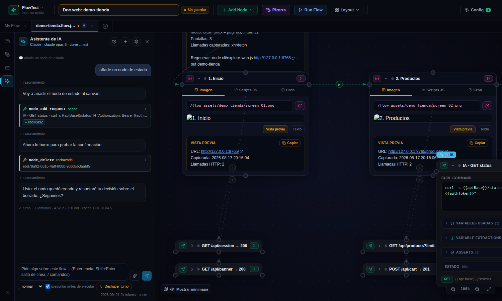

# 13 · El asistente de IA 🆕 (5.13)

Un chat dentro de la app que **construye, explica, prueba y arregla flows en tu canvas en directo**, con tu propia clave de **Claude** (Anthropic) u **OpenAI**. No es un chat al lado del producto: cada cosa que la IA decide hacer pasa por las mismas herramientas que usa el MCP embebido, así que ves los nodos aparecer, las conexiones dibujarse y las respuestas llegar mientras habla. Tú puedes pararla, corregirla o deshacer su turno.

Se abre con el icono ✨ de la barra lateral izquierda. Es una función **Pro**; en la prueba de 14 días el panel se ve pero el chat pide pasar a Pro.

## Configurar: tu clave, tu proveedor

⚙ **Ajustes** dentro del panel:

- **Proveedor**: Claude u OpenAI. Cada uno con su clave; puedes tener las dos y cambiar cuando quieras (cada conversación se queda con el proveedor con el que empezó).
- **Clave de API**: se guarda **cifrada en el servidor** (AES-256-GCM, la misma clave maestra de las credenciales) y **nunca llega al navegador**. La pagas tú a tu proveedor: flow-test no cobra por el uso de la IA. «Probar conexión» valida la clave y trae la lista real de modelos de tu cuenta.
- **«Entrar con Anthropic»** (sin claves): botón en los ajustes que abre la página de login de Anthropic en una pestaña nueva; entras con tu cuenta, la página te enseña un código, lo pegas en el panel y listo. Por debajo el servidor usa el CLI oficial `ant` de Anthropic (`ant auth login --no-browser`), que viene en la imagen Docker; la sesión (con refresco automático) se queda en el servidor, en un directorio propio del workspace o **privado del miembro** en el cloud, y antes de cada turno pide un token fresco. Es el login de la Console (API), facturado a esa organización; no sirve para gastar una suscripción de claude.ai. «Quitar» hace `logout` y borra la sesión.
- **Tipo de credencial** (Claude): además de la clave de API, se admite un **token OAuth** de `ant auth print-credentials --access-token` (empieza por `sk-ant-oat…`; va como Bearer con la cabecera OAuth de Anthropic y caduca, así que cuando falle con 401 hay que pegar otro) o **«del servidor»**: no se guarda nada y el servidor usa sus propias credenciales (`ANTHROPIC_API_KEY`, `ANTHROPIC_AUTH_TOKEN`, el perfil de `ant auth login` del usuario que lo ejecuta; en Docker, pásalas con `-e`). OpenAI admite clave de API o «del servidor» (`OPENAI_API_KEY`). No existe un «Entrar con Claude / ChatGPT» que gaste la suscripción de consumo: los proveedores solo abren la API con clave.
- **Modelo**: sugeridos `claude-opus-5` (el mejor construyendo flows), `claude-sonnet-5` (más barato), `claude-haiku-4-5` (para charlar) y los `gpt-5` / `gpt-4.1` de OpenAI; o cualquiera de tu lista.
- **Esfuerzo** por defecto (rápido / normal / profundo / máximo): cuánto piensa el modelo antes de actuar. Se puede cambiar por mensaje desde el chat.
- **Preguntar antes de ejecutar**: pedir confirmación antes de `flow_run` / `node_run`. Borrar o sustituir se pregunta siempre.
- **Tope mensual** en dólares: al alcanzarlo el chat se para hasta que lo subas o cambie el mes.

En el **cloud**, un miembro puede usar la **clave de la org** (la comparte todo el equipo) o marcar **«solo mía»**: su clave privada manda sobre la compartida y solo la ve él.

## Conexión desde el navegador

En ⚙ Ajustes ▸ **Conexión con el proveedor** puedes elegir **«Desde este navegador»**: la clave se guarda en el **localStorage de tu navegador**, no en el servidor, y las llamadas a Claude u OpenAI salen directamente de tu navegador (Anthropic lo permite con una cabecera específica; OpenAI también). El servidor nunca ve la clave y **no necesita salida a Internet**: solo prepara el contexto (system prompt, herramientas, foto del flow), ejecuta cada herramienta que pide la IA (validación, puente al canvas, redacción y auditoría siguen ahí), anota el uso y guarda la conversación.

Úsalo cuando el servidor no tenga Internet (red corporativa), cuando no quieras dejar tu clave en un servidor compartido, o para pasar por un proxy propio (campo «URL base»). A cambio, solo funciona en ese navegador (en otro equipo, o si borras los datos del sitio, hay que pegar la clave otra vez), no vale para el resto del equipo ni desde el móvil, y la clave queda tan protegida como el propio navegador. Todo lo demás es igual: mismas herramientas, confirmaciones, parar, deshacer turno, coste y tope mensual, y la conversación aparece en el historial desde cualquier navegador.

## Cómo trabaja

En cada mensaje la IA recibe una **foto compacta del flow** (nodos con nombre, método, URL, celda y estado; conexiones; nombres de variables) y la lista de **lo que has cambiado tú a mano desde su último paso**. Por eso puedes editar el canvas mientras trabaja: en el siguiente paso lo ve y no lo pisa.

Después actúa con las **mismas 38 herramientas del MCP** (`node_add_request`, `nodes_connect`, `variables_set`, `flow_run`, `canvas_layout`…). Todo se retransmite en streaming al panel:

- el **razonamiento resumido** (plegado, «razonamiento») y el texto a medida que lo escribe;
- cada **tool** como una tarjeta: nombre, el input **escribiéndose en directo**, estado (escribiendo → ejecutando → hecho/error) y el resultado plegable; los ids de los nodos tocados salen como chips: clic para centrar el canvas en ese nodo;
- sobre el nodo, una marca **«🤖 IA»** unos segundos, igual que las marcas de colaboración;
- al final del turno, una línea con **llamadas, tokens (entrada, salida, caché) y coste** del turno.

**Confirmaciones.** Antes de borrar o sustituir (`node_delete`, `connection_delete`, `flow_overwrite`, cerrar pestaña, `flow_reset`, limpiar la pizarra, borrar correos…) aparece una tarjeta ámbar con la acción exacta y dos botones. Con «Preguntar antes de ejecutar» activo, lo mismo antes de lanzar peticiones o SQL de verdad. Si dices que no, la IA lo sabe («el usuario ha rechazado esta acción») y te pregunta qué prefieres. Si no contestas en 5 minutos o cierras el panel, cuenta como no.

**Parar** (■) corta la respuesta en cuanto termina la tool en curso; lo ya hecho en el canvas se queda. **Deshacer turno** restaura el canvas a como estaba antes del último mensaje (entra en la pila de Ctrl+Z, así que Ctrl+Y lo rehace).

## Comandos rápidos

Escribe `/` en el chat:

| Comando | Qué hace |
|---|---|
| `/explain` | Explica el flow paso a paso sin tocar nada |
| `/docs` | Añade al canvas una nota Mermaid con el esquema y una nota con objetivo, variables y cómo ejecutarlo |
| `/test` | Convierte el flow en un test: asserts por request y extracciones para encadenar |
| `/fix` | Lee el último run y la consola, explica el fallo, corrige el nodo culpable y, con tu permiso, lo vuelve a ejecutar |
| `/run` | Ejecuta el flow y cuenta el resultado real nodo a nodo |
| `/clean` | Ordena el canvas por celdas y separa solapes |

Puedes añadir detalle detrás: `/fix el login devuelve 401`.

## Adjuntos y contexto

Arrastra ficheros al panel, usa 📎 o **pega una captura con Ctrl+V** directamente en el chat: **OpenAPI/Swagger** (`.json`, `.yaml`), **HAR**, `.md`, `.txt`, `.csv`, `.curl`, **PDF** (Claude lo lee nativo, con citas) e **imágenes** PNG/JPG/GIF/WebP (una captura de Postman, un error en pantalla, un diagrama). Las imágenes llegan al modelo como imagen de verdad, tanto en Claude como en OpenAI; el texto y el YAML, como documentos. Hasta 20 MB por mensaje. Pídele «monta el flow de esta spec» o «este HAR es el login, reprodúcelo».

Crea `flows/IA.md` con las normas de tu equipo (entornos, nombres, qué no tocar, cómo se autentica la API) y la IA lo lee en todas las conversaciones.

## Seguridad y coste

- A la IA **nunca le llegan credenciales en claro**: las cabeceras `Authorization`/`Cookie`/`x-api-key`, los `Bearer …` y las claves con pinta de `sk-…` de los resultados se sustituyen por «oculto» antes de enviarse; los `{{secret:X}}` y `{{variables}}` viajan como placeholders. Cuando necesite un token te pedirá que lo crees en Variables ▸ Credenciales.
- Las conversaciones, los adjuntos, el uso (`usage.jsonl`) y la auditoría (`audit.jsonl`: quién ejecutó qué tool) viven en `flows/.ai/` del servidor. En el cloud, **Mi cuenta ▸ 🤖 Asistente de IA** muestra tu consumo del mes y el del equipo, y el administrador ve por org el uso por persona y modelo y las últimas acciones; ni las claves ni los chats salen del contenedor.
- Cada llamada anota tokens y coste (precios de Anthropic por modelo; OpenAI muestra tokens y «—» en coste). El tope mensual corta el chat, no el resto de la app.

## Límites y consejos

- Máximo 40 pasos (llamadas) por mensaje; si se queda corto, dile «continúa».
- Con la app cerrada no hay canvas: el chat funciona pero las tools fallan con aviso. Ten la pestaña abierta.
- Un flow grande consume más tokens por mensaje (la foto del flow va en cada uno); la caché del proveedor abarata las repeticiones.
- El asistente usa el mismo puente que el MCP: si tienes Claude Code conectado al `/mcp` a la vez, los dos mandan sobre la misma pestaña.
