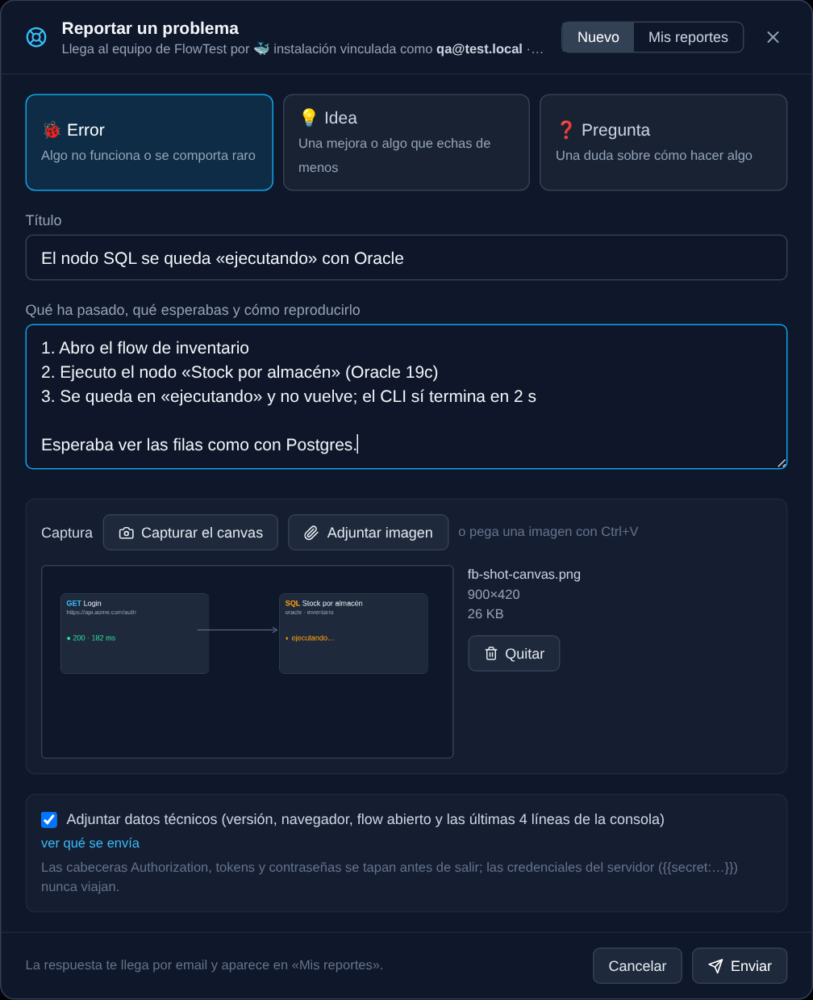
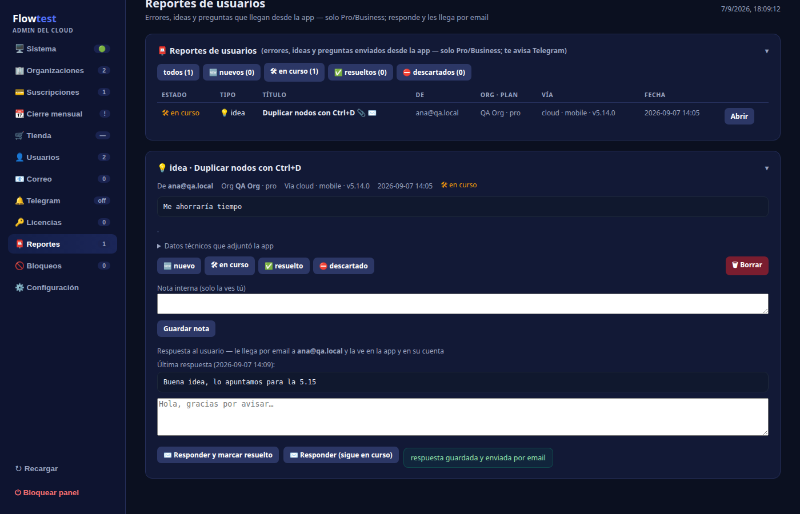

# 14 · Reportar un problema 🆕 (5.14)

Desde la app puedes mandar al equipo de FlowTest un **error, una idea o una pregunta**, con captura y datos técnicos, sin salir a ningún formulario externo. Es una función de los planes **Pro y Business**: en la prueba gratuita la entrada se ve con el chip `PRO` y explica cómo pasar a Pro.

## Dónde está

- **Escritorio**: botón **Config** (arriba a la derecha) ▸ **Reportar un problema**.
- **Móvil** (`/m` y la app Android): el botón 💬 de la barra superior, tanto en la lista como dentro de un flow.

## Qué se envía

1. **Tipo**: 🐞 Error · 💡 Idea · ❓ Pregunta.
2. **Título** y **descripción** (para un error: qué ha pasado, qué esperabas y cómo reproducirlo).
3. **Captura** (opcional): «Capturar el canvas» hace una foto del flow visible tal cual lo ves (el mismo motor que Exportar PDF); «Adjuntar imagen» o **Ctrl+V** pega cualquier imagen; en el móvil, foto de la cámara o de la galería. Se reduce a 1800 px para que pese poco.
4. **Datos técnicos** (opcional, marcado por defecto): versión de la app, navegador, tamaño de pantalla, flow abierto (nombre, fichero, nº de nodos) y las últimas 60 líneas de la Consola. «Ver qué se envía» lo muestra antes de enviar.

> **Privacidad.** El servidor tapa cabeceras `Authorization`, tokens tipo `sk-…`, contraseñas y `{{secret:X}}` antes de que salga nada; las credenciales del servidor nunca viajan. El navegador no habla con el servidor de cuentas: el reporte sale de tu instalación con su propia credencial.

## Cómo llega

| Instalación | Vía |
|---|---|
| Cloud (`tuorg.app.flowtest.es`) | El contenedor de tu organización lo entrega con tu usuario. |
| Docker vinculado a tu cuenta cloud | Con el token de vinculación (el reporte lleva el dueño del token). |
| Docker con licencia | Con la licencia RS256 (el titular). |
| Sin identificar (prueba local) | No se puede enviar: vincula o activa una licencia en Config ▸ Licencia. |

Si el servidor de cuentas no responde (sin red, mantenimiento), el reporte se guarda en la **bandeja de salida** de tu instalación y se reintenta solo cada 5 minutos; en «Mis reportes» aparece como *pendiente de envío* con el botón «Reintentar ahora».

## Mis reportes y la respuesta

La pestaña **«Mis reportes»** del mismo modal (y de la pantalla móvil) lista lo que has enviado desde esa instalación con su estado — *recibido · en curso · resuelto · descartado* — y la **respuesta del equipo** cuando la hay. La respuesta te llega también **por email** y la ves en tu cuenta de flowtest.es (**account.html ▸ 📮 Mis reportes**), junto a la captura que adjuntaste.

## Para el administrador (flow-accounts)

En el admin aparece la sección **📮 Reportes** con un contador de pendientes: filtros por estado, detalle con la captura, los datos técnicos y la consola, nota interna, cambio de estado y **responder** (le llega por email al usuario y aparece en su app). Cada reporte nuevo avisa por Telegram (categoría `feedback`). Las capturas viven en `data/feedback/`.

## Preguntas rápidas

- **¿Cuánto puede pesar?** La imagen hasta 6 MB (ya reducida); la descripción hasta 20 000 caracteres.
- **¿Lo ven los demás miembros de mi organización?** No: en la app cada uno ve los suyos (en el cloud, por usuario); el administrador de FlowTest los ve todos.
- **¿Puedo borrar uno?** Escríbelo en un reporte nuevo o responde al email; el equipo lo retira.
